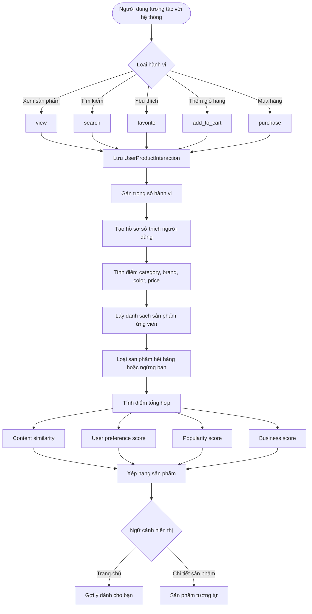

# Luồng Hoạt Động Gợi Ý Sản Phẩm

## 1. Mục tiêu

Tính năng gợi ý sản phẩm giúp cá nhân hóa trải nghiệm mua sắm, đề xuất sản phẩm tương tự và sản phẩm phù hợp theo hành vi người dùng, đặc trưng sản phẩm, độ phổ biến.

Hướng triển khai phù hợp cho hệ thống hiện tại là hybrid recommendation:

```text
Hybrid Recommendation
= User behavior
+ Content-based filtering
+ Popularity score
+ Business score
```

## 2. Đầu vào

| Nhóm dữ liệu | Nội dung |
|---|---|
| Dữ liệu sản phẩm | Category, gender, brand, color, fit type, price, discount, rating |
| Dữ liệu tồn kho | Còn hàng, hết hàng, ngừng bán |
| Hành vi người dùng | `view`, `search`, `favorite`, `add_to_cart`, `purchase` |
| Ngữ cảnh hiển thị | Home, Product Detail |
| Dữ liệu đơn hàng | Sản phẩm đã mua, tần suất mua, thời điểm mua |
| Dữ liệu đánh giá | Rating, review count, size fit |

## 3. Đầu ra

| Đầu ra | Ý nghĩa |
|---|---|
| Danh sách sản phẩm gợi ý | Các sản phẩm đã được xếp hạng |
| Score | Điểm phù hợp tổng hợp |
| Reason | Lý do gợi ý: tương tự, hợp gu, bán chạy, đang sale, mới về |
| Recommendation context | Vị trí hiển thị: home, detail |

Các API nên có trong MVP:

```http
POST /interactions
POST /recommendations/events
GET /recommendations/me?limit=10
GET /recommendations/products/:productId/similar?limit=8
```

## 4. Luồng Hoạt Động



## 5. Trọng số hành vi

| Hành vi | Trọng số đề xuất |
|---|---:|
| `view` | 1 |
| `search` | 2 |
| `favorite` | 3 |
| `add_to_cart` | 5 |
| `purchase` | 10 |

Chống spam: 1 user + 1 product + `action=view` chỉ ghi lại sau 30-60 phút. `purchase` chỉ ghi ở backend khi tạo đơn thành công.

Nên áp dụng time decay để hành vi gần đây có ảnh hưởng mạnh hơn:

```text
effectiveWeight = actionWeight * decay
```

Ví dụ:

| Khoảng thời gian | Decay |
|---|---:|
| Dưới 7 ngày | 1.0 |
| 7-30 ngày | 0.7 |
| 30-90 ngày | 0.4 |
| Trên 90 ngày | 0.2 |

## 6. Công thức scoring

```text
score =
  0.40 * contentSimilarity
+ 0.30 * userPreferenceScore
+ 0.20 * popularityScore
+ 0.10 * businessScore
```

Ý nghĩa:

| Thành phần | Cơ sở tính |
|---|---|
| `contentSimilarity` | Category, gender, brand, color, fit type, price bucket |
| `userPreferenceScore` | Lịch sử hành vi người dùng |
| `popularityScore` | Sold quantity, rating, review count |
| `businessScore` | Còn hàng, đang sale, sản phẩm mới |

## 7. Cơ sở triển khai

Tính năng dựa trên các collection/module hiện có:

- `Product`: dữ liệu sản phẩm và biến thể.
- `Category`: gender, size template, fit type.
- `Brand`: thương hiệu.
- `Inventory`: tồn kho.
- `Favorite`: hành vi yêu thích.
- `Cart`: hành vi thêm giỏ.
- `Order`: hành vi mua hàng.
- `Review`: rating và phản hồi size fit.

Codebase hiện tại đã có module `interactions`/`recommendations`; module `ml` vẫn đang rỗng vì chưa bước sang giai đoạn huấn luyện. Mobile đã dùng API recommendation tại Home, Product Detail và Cart:

```text
backend/src/modules/interactions
backend/src/modules/recommendations
```

Các model dữ liệu recommendation hiện có:

```text
UserProductInteraction
- userId
- productId
- actionType
- weight
- source
- metadata
- createdAt
- updatedAt

RecommendationEvent
- context
- recommendedProductId
- algorithmVersion
- score
- rank
- reasonCodes
- eventType
- requestId
- createdAt

RecommendationRequest
- requestId
- userId hoặc sessionId
- context
- sourceProductId
- algorithmVersion
- fallbackUsed
- items đã phát
- expiresAt
```

## 8. Nội dung có thể huấn luyện sau MVP

Giai đoạn đầu dùng rule-based scoring, chưa cần deep learning. Khi đủ dữ liệu, có thể huấn luyện các mô hình sau:

| Mô hình | Dữ liệu huấn luyện | Mục tiêu |
|---|---|---|
| User-product ranking | Interaction log | Xếp hạng sản phẩm phù hợp với từng user |
| Collaborative filtering | User-item matrix từ favorite/cart/purchase | Tìm user/sản phẩm có hành vi tương đồng |
| Product embedding | Category, mô tả, màu, brand, ảnh sản phẩm | Tính sản phẩm tương tự |

Nhãn hoặc tín hiệu huấn luyện có thể lấy từ:

- Sản phẩm đã mua.
- Sản phẩm đã thêm giỏ.
- Sản phẩm đã yêu thích.
- Sản phẩm đã click từ recommendation.

## 9. Candidate pool và loại trừ

Trước khi tính score cần lọc danh sách ứng viên:

```text
- Bỏ sản phẩm hết hàng hoặc ngừng bán (active = false, status != 'active').
- Bỏ chính sản phẩm đang xem (trong /similar).
- Bỏ sản phẩm đã mua gần đây (mặc định 30 ngày) cho /me.
- Giới hạn candidate pool theo category/gender tương đồng để giảm chi phí tính.
```

Đảm bảo đa dạng (diversity/freshness):

```text
- Mỗi category/brand không quá 40% tổng kết quả.
- Ưu tiên tối thiểu 20% sản phẩm mới (newnessBoost) để không toàn best-seller cũ.
- Có thể xáo trộn nhẹ top-N khi score gần nhau để tránh lặp y hệt giữa các lần gọi.
```

## 10. Cold-start

| Trường hợp | Chiến lược |
|---|---|
| Khách chưa đăng nhập | best-seller + newest + sale + rating cao |
| User mới, chưa có hành vi | popular + newest + khớp profile gender nếu có + category nổi bật |
| Sản phẩm mới | content-based filtering theo category + gender + brand + color + price |

Guest user có thể gắn `userId` tạm bằng deviceId/sessionId, sau khi đăng nhập có thể merge interaction cũ sang account.

## 11. Kế hoạch thực hiện

| Giai đoạn | Nội dung |
|---|---|
| 1 | Tạo model `UserProductInteraction`, `RecommendationEvent` và API tracking |
| 2 | Gắn tracking vào product detail, search, favorite, cart, order |
| 3 | Backfill interaction từ dữ liệu favorite/cart/order cũ |
| 4 | Tạo API sản phẩm tương tự bằng content-based filtering |
| 5 | Tạo API gợi ý cá nhân hóa `/recommendations/me` |
| 6 | Đánh giá bằng Precision@K, Recall@K, Coverage, Diversity, CTR, add-to-cart rate |

## 12. Nguồn lý thuyết và tham khảo

- Content-based filtering: https://developers.google.com/machine-learning/recommendation/content-based/basics
- Collaborative filtering: https://developers.google.com/machine-learning/recommendation/collaborative/basics
- Hybrid recommender systems: https://link.springer.com/article/10.1023/A%3A1021240730564
- Implicit feedback: https://www.chrisvolinsky.com/publications/17546-collaborative-filtering-for-implicit-feedback-datasets
- Amazon item-to-item recommendation: https://www.amazon.science/the-history-of-amazons-recommendation-algorithm
- Fashion recommender systems survey: https://link.springer.com/article/10.1007/s42979-023-01932-9
- Recommendation evaluation metrics: https://www.shaped.ai/blog/evaluating-recommendation-systems-part-1
