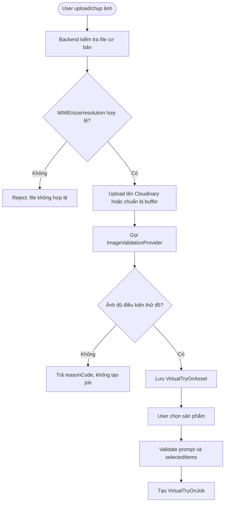
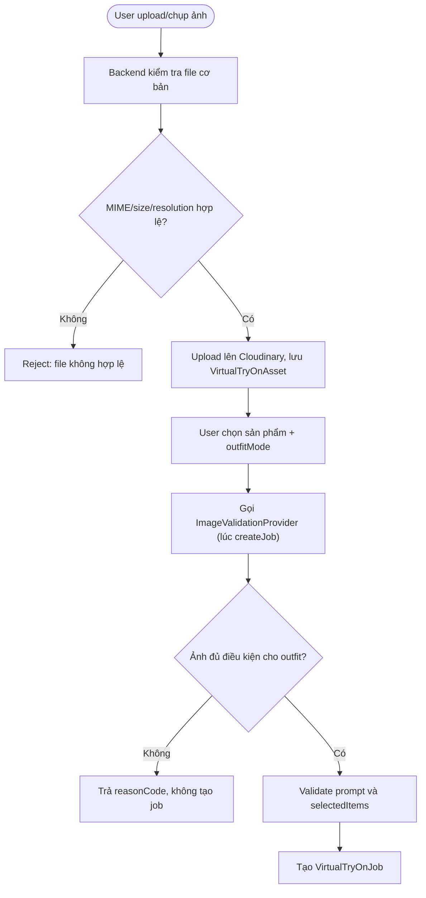

# Image Validation & Nhận Diện Người Cho Phòng Phối Đồ Ảo

## 1. Mục tiêu

Tài liệu này ghi nhận hướng xử lý ảnh đầu vào của phòng phối đồ ảo:

- Kiểm tra ảnh có người rõ ràng để thử đồ hay không.
- Kiểm tra ảnh có đúng 1 người chính hay không.
- Kiểm tra vùng cơ thể có đủ để ghép trang phục hay không.
- Kiểm tra chất lượng ảnh: quá mờ, quá tối, quá nhỏ.
- Kiểm tra an toàn nội dung ảnh.
- Thiết kế sẵn cổng để sau này cắm model riêng.

Mục tiêu không phải là xác nhận tuyệt đối "người thật 100%". Với một ảnh tĩnh, ảnh AI, mannequin, poster hoặc ảnh chỉnh sửa có thể vẫn giống người. Vì vậy tiêu chí đúng hơn là:

```text
Ảnh có một người/đối tượng người rõ ràng, đủ điều kiện để thử đồ ảo.
```

## 2. Quyết định thiết kế

MVP không tự train model từ đầu.

Backend nên có một lớp `ImageValidationProvider` để thay đổi công nghệ phía sau mà không làm lại luồng chính.

```ts
type ImageValidationProvider =
  | 'disabled'
  | 'mock'
  | 'cloud_vision'
  | 'local_pretrained'
  | 'custom_model';
```

Nguyên tắc:

- Backend là nơi quyết định ảnh có được dùng để tạo job hay không.
- Mobile/web chỉ hỗ trợ UX, không phải nguồn kiểm tra cuối cùng.
- Provider trả về response chuẩn hóa.
- Có thể dùng model/provider có sẵn trước.
- Sau này nếu có model riêng thì chỉ thêm adapter `custom_model`.
- Không thêm collection mới ở MVP.

## 2.1. Type contracts (TypeScript)

Đây là type chính thức dev copy khi code, không phải ví dụ.

```ts
export type ImageValidationProviderName =
  | 'disabled'
  | 'mock'
  | 'cloud_vision'
  | 'local_pretrained'
  | 'custom_model';

export type ImageValidationQualityLevel = 'ok' | 'warn' | 'fail';

export type ImageValidationQuality = {
  blur: ImageValidationQualityLevel;
  brightness: ImageValidationQualityLevel;
  resolution: ImageValidationQualityLevel;
};

export type ImageValidationBodyVisibility =
  | 'good'
  | 'partial'
  | 'unknown';

export type ImageValidationBoundingBox = {
  x: number;
  y: number;
  width: number;
  height: number;
};

export type ImageValidationSafetyFlag = 'sexual' | 'violence' | 'explicit' | 'child';

export type ImageValidationInput = {
  imageBuffer: Buffer;
  mimeType: string;
  width: number;
  height: number;
  bytes: number;
  source: 'upload' | 'camera';
  outfitMode?: 'single' | 'top_bottom' | 'full_set';
};

export type ImageValidationResult = {
  allowed: boolean;
  reasonCode: string | null;
  message: string | null;
  provider: ImageValidationProviderName;
  personCount: number;
  mainPersonScore: number;
  mainPersonBox?: ImageValidationBoundingBox | null;
  bodyVisibility: ImageValidationBodyVisibility;
  poseConfidence?: number;
  quality: ImageValidationQuality;
  safetyFlags: ImageValidationSafetyFlag[];
};

export interface ImageValidationProvider {
  readonly name: ImageValidationProviderName;
  validate(input: ImageValidationInput): Promise<ImageValidationResult>;
}
```

Lưu ý:
- `imageBuffer` là bắt buộc. Validator luôn nhận buffer, không nhận URL, để giữ quyền riêng tư và không phụ thuộc network provider.
- `outfitMode` là optional vì validate có thể chạy ở 2 thời điểm (xem mục 6.1).
- Provider phải `throw` khi lỗi kỹ thuật (provider down), không trả `allowed: false` với `VALIDATION_PROVIDER_FAILED`. Service layer sẽ bắt và áp dụng fallback policy (xem mục 6.3).

## 2.2. Env config

| Env | Mặc định | Ý nghĩa |
|---|---|---|
| `IMAGE_VALIDATION_PROVIDER` | `mock` | Provider dùng để validate |
| `IMAGE_VALIDATION_PERSON_SCORE_THRESHOLD` | `0.5` | Ngưỡng confidence để chấp nhận người chính |
| `IMAGE_VALIDATION_MIN_WIDTH` | `400` | Resolution tối thiểu (px) |
| `IMAGE_VALIDATION_MIN_HEIGHT` | `400` | Resolution tối thiểu (px) |
| `IMAGE_VALIDATION_BLUR_THRESHOLD` | `100` | Variance of Laplacian dưới ngưỡng này = mờ |
| `IMAGE_VALIDATION_BRIGHTNESS_MIN` | `40` | Brightness trung bình tối thiểu (0-255) |
| `IMAGE_VALIDATION_BRIGHTNESS_MAX` | `220` | Brightness trung bình tối đa (0-255) |
| `IMAGE_VALIDATION_FAIL_OPEN` | `false` | `true` = cho qua khi provider lỗi (fail-open), `false` = chặn (fail-closed) |
| `IMAGE_VALIDATION_MOCK_REASON_CODE` | (rỗng) | Mock provider trả reasonCode cố định, dùng test UI |
| `IMAGE_VALIDATION_CUSTOM_MODEL_URL` | (rỗng) | Endpoint `custom_model` adapter |
| `IMAGE_VALIDATION_CUSTOM_MODEL_TIMEOUT_MS` | `15000` | Timeout gọi custom_model |

## 2.3. Fallback policy khi provider lỗi

Khi provider thật (`cloud_vision`/`local_pretrained`/`custom_model`) throw lỗi kỹ thuật:

| `IMAGE_VALIDATION_FAIL_OPEN` | Hành xử |
|---|---|
| `false` (mặc định) | Chặn tạo asset, trả `VALIDATION_PROVIDER_FAILED`, yêu cầu thử lại. An toàn hơn, tránh ảnh xấu lọt qua. |
| `true` | Cho qua, log warning, tạo asset bình thường. Dùng khi ưu tiên uptime hơn kiểm tra chặt. |

Lý do mặc định fail-closed: tính năng phối đồ cần ảnh người tốt mới ra kết quả đúng, cho qua ảnh xấu sẽ tốn tiền AI provider và ra ảnh sai.

## 3. Nguồn dữ liệu đầu vào

| Input | Nguồn | Cách dùng |
|---|---|---|
| File ảnh upload | Mobile/web gửi lên backend | Kiểm tra MIME, size, width, height |
| `source` | Request upload asset | Phân biệt `camera` hoặc `upload` |
| Cloudinary metadata | Kết quả upload | Lấy URL, width, height, bytes |
| Ảnh đã upload | Cloudinary URL hoặc buffer | Gửi vào image validation provider |
| Config provider | `.env` | Chọn `mock`, `local_pretrained`, `cloud_vision`, `custom_model` |
| Threshold | Backend config | Ngưỡng person score, body visibility, blur, brightness |

Input tối thiểu cho validator:

```json
{
  "imageUrl": "https://...",
  "mimeType": "image/jpeg",
  "width": 1080,
  "height": 1440,
  "bytes": 1234567,
  "source": "camera"
}
```

Nếu provider cần xử lý trực tiếp buffer:

```json
{
  "imageBuffer": "<binary>",
  "mimeType": "image/jpeg",
  "width": 1080,
  "height": 1440
}
```

## 4. Đầu ra chuẩn hóa

Nếu ảnh hợp lệ:

```json
{
  "allowed": true,
  "reasonCode": null,
  "message": null,
  "provider": "local_pretrained",
  "personCount": 1,
  "mainPersonScore": 0.94,
  "mainPersonBox": {
    "x": 0.21,
    "y": 0.08,
    "width": 0.58,
    "height": 0.86
  },
  "bodyVisibility": "good",
  "poseConfidence": 0.88,
  "quality": {
    "blur": "ok",
    "brightness": "ok",
    "resolution": "ok"
  },
  "safetyFlags": []
}
```

Nếu ảnh không hợp lệ:

```json
{
  "allowed": false,
  "reasonCode": "NO_PERSON_DETECTED",
  "message": "Ảnh cần có một người rõ ràng để thử đồ",
  "provider": "local_pretrained",
  "personCount": 0,
  "mainPersonScore": 0.12,
  "bodyVisibility": "unknown",
  "quality": {
    "blur": "ok",
    "brightness": "ok",
    "resolution": "ok"
  },
  "safetyFlags": []
}
```

## 5. Reason code cần có

| Reason code | Ý nghĩa | Cách xử lý UI |
|---|---|---|
| `NO_PERSON_DETECTED` | Không phát hiện người | Yêu cầu chọn ảnh có người rõ hơn |
| `MULTIPLE_PEOPLE_DETECTED` | Có nhiều người | Yêu cầu ảnh chỉ có 1 người chính |
| `PERSON_TOO_SMALL` | Người quá nhỏ trong khung | Gợi ý chụp gần hơn |
| `BODY_NOT_VISIBLE` | Không thấy đủ vùng cơ thể | Gợi ý chụp toàn thân/nửa thân tùy outfit |
| `POSE_NOT_SUPPORTED` | Tư thế khó xử lý | Gợi ý đứng thẳng, mặt hướng camera |
| `IMAGE_TOO_BLURRY` | Ảnh mờ | Gợi ý chụp lại rõ hơn |
| `IMAGE_TOO_DARK` | Ảnh tối | Gợi ý chụp nơi đủ sáng |
| `IMAGE_TOO_SMALL` | Resolution thấp | Yêu cầu ảnh chất lượng cao hơn |
| `IMAGE_POLICY_BLOCKED` | Ảnh nhạy cảm hoặc không an toàn | Chặn tạo job |
| `VALIDATION_PROVIDER_FAILED` | Provider lỗi kỹ thuật | Cho thử lại hoặc fallback tùy config |

### 5.1. Mapping reason code → HTTP status + error response

Validation chạy ngầm trong `POST /virtual-try-on/jobs` (createJob). Không tách endpoint riêng ở MVP. Khi ảnh fail, createJob trả error response theo convention hiện tại của `errorResponse()`:

```json
{
  "message": "Ảnh cần có một người rõ ràng để thử đồ",
  "errorCode": "NO_PERSON_DETECTED"
}
```

Map HTTP status:

| Reason code | HTTP | Lý do |
|---|---|---|
| `NO_PERSON_DETECTED` | 422 | Request hợp lệ nhưng ảnh không đủ điều kiện |
| `MULTIPLE_PEOPLE_DETECTED` | 422 | |
| `PERSON_TOO_SMALL` | 422 | |
| `BODY_NOT_VISIBLE` | 422 | |
| `POSE_NOT_SUPPORTED` | 422 | |
| `IMAGE_TOO_BLURRY` | 422 | |
| `IMAGE_TOO_DARK` | 422 | |
| `IMAGE_TOO_SMALL` | 422 | |
| `IMAGE_POLICY_BLOCKED` | 403 | Cấm nội dung, không chỉ "không đủ điều kiện" |
| `VALIDATION_PROVIDER_FAILED` | 503 | Provider down, dùng cho retry |

Dùng 422 (Unprocessable Entity) thay vì 400 vì request body hợp lệ, chỉ là nội dung ảnh không pass nghiệp vụ.

Frontend/mobile bắt `errorCode` để hiển thị message tương ứng (mục 5 bảng "Cách xử lý UI"), không phụ thuộc HTTP status.

## 6. Luồng xử lý



Ghi chú triển khai:

- Nếu upload Cloudinary trước validation, ảnh fail nên được xóa khỏi Cloudinary hoặc không tạo asset.
- Nếu validation dùng buffer trước upload, chỉ upload khi ảnh hợp lệ.
- Cách tốt hơn cho quyền riêng tư là validate từ buffer trước, sau đó mới upload ảnh hợp lệ.

### 6.1. Validation chạy ở thời điểm nào

Có hai thời điểm có thể validate. Quyết định:

```text
Validate ở BƯỚC UPLOAD (không biết outfitMode) — KHÔNG khuyến nghị.
Validate ở BƯỚC CREATE JOB (biết outfitMode) — KHUYẾN NGHỊ.
```

**Lý do chọn createJob:**

- `bodyVisibility` phụ thuộc `outfitMode`. Ví dụ:
  - `single` (váy/đầm): cần thấy toàn thân.
  - `top_bottom`: cần thấy ít nhất nửa trên + nửa dưới.
  - `full_set`: cần thấy toàn thân rõ ràng.
- Nếu validate ở upload, chưa biết outfit → chỉ kiểm tra được "có người không", không kiểm tra được vùng cơ thể có đủ cho outfit đó.
- Validate ở createJob cho phép quyết định chính xác `BODY_NOT_VISIBLE` theo outfit.
- Upload ảnh (tạo asset) vẫn được giữ riêng, vì ảnh người dùng có thể dùng lại cho nhiều job khác nhau với outfit khác nhau.

**Nhược điểm & cách xử lý:**

- Asset lưu ảnh chưa validate → có thể có ảnh rác. Chấp nhận được vì asset chỉ là thư viện ảnh nguồn, chưa tốn tiền AI.
- Người dùng chọn outfit xong mới biết ảnh có hợp không → UX cần cảnh báo rõ ở UI chọn outfit, không đợi đến lúc submit mới báo.

**Luồng cập nhật:**



### 6.2. Body visibility theo outfitMode

Validator nhận `outfitMode` trong input và áp dụng quy tắc:

| outfitMode | Vùng cơ thể tối thiểu | Nếu không đủ → reasonCode |
|---|---|---|
| `single` | Full body (đầu → chân) | `BODY_NOT_VISIBLE` |
| `top_bottom` | Upper + lower body (vai → hông tối thiểu) | `BODY_NOT_VISIBLE` |
| `full_set` | Full body rõ ràng + ít che khuất | `BODY_NOT_VISIBLE` |

Validator trả `bodyVisibility: 'good' | 'partial' | 'unknown'`:
- `good`: đủ vùng cho outfitMode → `allowed: true` (nếu các kiểm tra khác pass).
- `partial`: thiếu vùng → `allowed: false`, `reasonCode: BODY_NOT_VISIBLE`.
- `unknown`: provider không xác định được (vd mock) → tùy config: cho qua hoặc chặn.

### 6.3. Tích hợp vào `uploadAsset` và `createJob` hiện tại

**`uploadAsset` (không đổi nhiều):**

```text
1. Multer memoryStorage đã có buffer sẵn (xem upload.middleware.ts).
2. Kiểm tra MIME/size/resolution cơ bản (đã có).
3. Upload Cloudinary → tạo VirtualTryOnAsset (như hiện tại).
4. KHÔNG gọi ImageValidationProvider ở bước này.
```

**`createJob` (thêm validation):**

```text
1. Lấy sourceAssetId từ input → load VirtualTryOnAsset.
2. Download buffer từ Cloudinary URL (hoặc dùng cache nếu đã validate).
3. Gọi ImageValidationProvider.validate({ imageBuffer, ..., outfitMode }).
4. Nếu provider throw:
   - IMAGE_VALIDATION_FAIL_OPEN=true → log warning, bỏ qua validation.
   - IMAGE_VALIDATION_FAIL_OPEN=false → throw VALIDATION_PROVIDER_FAILED, 503.
5. Nếu result.allowed=false → throw theo reasonCode (mục 5).
6. Nếu result.allowed=true → tiếp tục validateCreateJobInput (prompt, selectedItems) → tạo job.
```

Quyền riêng tư: validator nhận buffer, không gửi URL ra ngoài trừ khi provider là `cloud_vision`/`custom_model` (provider đó tự quyết định gửi gì).

## 7. Các provider đề xuất

### 7.1. `mock`

Dùng cho dev và test UI.

```text
Input ảnh bất kỳ -> trả allowed = true
```

Hoặc cho phép truyền flag test để giả lập lỗi:

```text
?mockReasonCode=NO_PERSON_DETECTED
```

### 7.2. `cloud_vision`

Dùng API bên ngoài để phát hiện người và moderation.

Ưu điểm:

- Tích hợp nhanh.
- Không cần vận hành model.
- Phù hợp giai đoạn đầu nếu muốn ra sản phẩm nhanh.

Nhược điểm:

- Tốn chi phí theo request.
- Ảnh phải gửi ra ngoài hệ thống.
- Phụ thuộc provider.

### 7.3. `local_pretrained`

Dùng model pretrained chạy ở backend hoặc service nội bộ.

Các lựa chọn phù hợp:

- YOLO/Ultralytics cho person detection.
- MediaPipe Pose cho pose/body landmark.
- ONNX Runtime nếu muốn chạy model ONNX trong service backend.

Ưu điểm:

- Kiểm soát dữ liệu tốt hơn.
- Không phụ thuộc API bên ngoài.
- Có thể tối ưu theo hạ tầng riêng.

Nhược điểm:

- Cần CPU/GPU và triển khai inference service.
- Cần theo dõi performance.
- Cần tự xử lý update model.

### 7.4. `custom_model`

Dành cho trường hợp sau này có model riêng.

Backend không cần biết model bên trong chạy gì. Chỉ cần adapter nhận ảnh và trả output theo contract chuẩn hóa.

Ví dụ HTTP contract:

```http
POST /validate-source-image
Content-Type: application/json
```

Request:

```json
{
  "imageUrl": "https://...",
  "requestId": "tryon_asset_123"
}
```

Response:

```json
{
  "allowed": true,
  "personCount": 1,
  "mainPersonScore": 0.94,
  "bodyVisibility": "good",
  "poseConfidence": 0.88,
  "quality": {
    "blur": "ok",
    "brightness": "ok",
    "resolution": "ok"
  },
  "safetyFlags": []
}
```

## 8. Nguồn tham khảo

Các nguồn này dùng để định hướng kỹ thuật, không bắt buộc phải dùng ngay trong MVP.

| Nguồn | Link | Dùng cho |
|---|---|---|
| MediaPipe Pose Landmarker | https://developers.google.com/edge/mediapipe/solutions/vision/pose_landmarker | Pose landmark, body visibility |
| MediaPipe Object Detector | https://developers.google.com/edge/mediapipe/solutions/vision/object_detector | Object/person detection |
| Ultralytics YOLO Object Detection | https://docs.ultralytics.com/tasks/detect | Person detection pretrained, export ONNX/TensorRT |
| ONNX Runtime | https://onnxruntime.ai/docs/ | Chạy model ONNX cross-platform |
| ONNX Runtime Node.js | https://onnxruntime.ai/docs/get-started/with-javascript/node.html | Nếu backend Node cần chạy inference |
| MediaPipe model customization | https://developers.google.com/edge/mediapipe/solutions/customization/object_detector | Nếu cần customize model từ dữ liệu riêng |

## 9. Dữ liệu cần có nếu tự làm model riêng

Không nên tự train từ đầu ở MVP. Nếu sau này thật sự muốn có model riêng, cần chuẩn bị dataset có nhãn.

### 9.1. Dữ liệu cho person detection

| Dữ liệu | Ý nghĩa |
|---|---|
| Ảnh người thật đa dạng | Nam, nữ, nhiều dáng người, nhiều bối cảnh |
| Bounding box người | Vị trí người trong ảnh |
| Nhãn số lượng người | 0, 1, nhiều người |
| Nhãn người chính | Người nào là subject chính |
| Ảnh fail case | Ảnh không có người, mannequin, poster, ảnh nhóm |

### 9.2. Dữ liệu cho pose/body visibility

| Dữ liệu | Ý nghĩa |
|---|---|
| Keypoints cơ thể | Vai, khuỷu tay, hông, gối, mắt cá |
| Nhãn vùng thấy được | Full body, upper body, lower body, unknown |
| Nhãn tư thế | Đứng thẳng, nghiêng, ngồi, bị che khuất |
| Nhãn occlusion | Bị che bởi vật/người khác |

### 9.3. Dữ liệu cho image quality

| Dữ liệu | Ý nghĩa |
|---|---|
| Blur score | Ảnh rõ hay mờ |
| Brightness score | Ảnh đủ sáng hay tối |
| Resolution | Kích thước ảnh |
| Nhãn QA | Pass/fail theo tiêu chuẩn thử đồ |

### 9.4. Dữ liệu cho safety moderation

| Dữ liệu | Ý nghĩa |
|---|---|
| Safety labels | Sensitive, violence, explicit, safe |
| Reviewer decision | Người kiểm duyệt xác nhận |
| Provider decision | Provider bên ngoài có chặn không |

## 10. Có lưu database không?

MVP không thêm collection mới.

Hai hướng lưu:

### Hướng khuyến nghị MVP

Không lưu chi tiết validation. Chỉ:

- Ảnh pass thì tạo `virtualtryonassets`.
- Ảnh fail thì trả lỗi ngay, không tạo asset/job.
- Ghi server log ở mức tối thiểu nếu cần debug.

### Hướng nâng cấp nhưng vẫn không thêm collection

Nếu cần trace lỗi, có thể thêm field optional trong `virtualtryonassets`:

```ts
validationResult?: {
  provider: string;
  allowed: boolean;
  reasonCode?: string;
  personCount?: number;
  mainPersonScore?: number;
  bodyVisibility?: string;
  quality?: {
    blur?: string;
    brightness?: string;
    resolution?: string;
  };
  checkedAt: Date;
}
```

Chỉ thêm field vào collection hiện có, không tạo collection mới.

## 11. Kế hoạch implement và trạng thái hiện tại

| Giai đoạn | Việc làm | Trạng thái | Ghi chú |
|---|---|---|---|
| 1 | Tạo type chuẩn `ImageValidationResult` (mục 2.1) | Đã làm | `backend/src/modules/virtual-try-on/image-validation/image-validation.types.ts` |
| 2 | Tạo `ImageValidationProvider` interface (mục 2.1) | Đã làm | `validate(input)` |
| 3 | Tạo provider `mock` | Đã làm | Dùng cho dev/test, đọc `IMAGE_VALIDATION_MOCK_REASON_CODE` |
| 4 | Tạo factory `createImageValidationProvider` | Đã làm | Hỗ trợ `disabled`, `mock`, `custom_model`; `cloud_vision` và `local_pretrained` đang để adapter chưa cấu hình |
| 5 | Gắn validation vào `createJob` (mục 6.3) | Đã làm | Chặn trước khi tạo job, theo `outfitMode` |
| 6 | Chuẩn hóa error response cho mobile (mục 5.1) | Đã làm | Trả `errorCode` + HTTP 422/403/503 qua `VirtualTryOnServiceError` |
| 7 | Thêm UI message trên mobile | Đã làm | `VirtualTryOnBuilderScreen` map reason code sang alert hướng dẫn chụp lại ảnh |
| 8 | Thêm provider thật | Chưa làm | `cloud_vision` hoặc `local_pretrained`, thuộc giai đoạn sau MVP |
| 9 | Thêm `custom_model` adapter | Đã làm mức MVP | Gửi ảnh dạng `imageBase64` tới `IMAGE_VALIDATION_CUSTOM_MODEL_URL` |
| 10 | Bổ sung test case fail/pass (mục 11.1) | Đã làm phần code | Có provider unit test và createJob integration test; chưa thêm bộ fixture ảnh thật |

### 11.0. Kết quả triển khai trong code

Backend đã thêm:

- `backend/src/modules/virtual-try-on/image-validation/image-validation.types.ts`: contract, reason code, message và HTTP status mapping.
- `backend/src/modules/virtual-try-on/image-validation/mock-image-validation.provider.ts`: provider mock/disabled cho MVP và test UI.
- `backend/src/modules/virtual-try-on/image-validation/custom-model-image-validation.provider.ts`: adapter `custom_model`.
- `backend/src/modules/virtual-try-on/image-validation/index.ts`: factory `createImageValidationProvider`.
- `backend/src/modules/virtual-try-on/virtual-try-on.service.ts`: download buffer từ asset Cloudinary, gọi validator trong `createJob`, áp dụng fail-open/fail-closed và policy override.
- `backend/.env.example`: thêm nhóm env `IMAGE_VALIDATION_*`.

Mobile đã thêm:

- `mobile/src/features/virtualTryOn/VirtualTryOnBuilderScreen.tsx`: map các `errorCode` của image validation sang alert thân thiện cho người dùng.

Test đã thêm:

- `backend/src/modules/virtual-try-on/image-validation/mock-image-validation.provider.test.ts`: test provider mock/disabled.
- `backend/src/modules/virtual-try-on/__tests__/virtual-try-on.image-validation.test.ts`: test flow `createJob` với validation fail, provider failed fail-closed, fail-open và provider disabled.

Lệnh đã chạy pass:

```bash
cd backend && npm test -- virtual-try-on.image-validation image-validation
cd backend && npm run build
cd backend && npm run lint
cd mobile && npm run typecheck
```

Phạm vi còn lại sau MVP:

- Chưa implement provider thật `cloud_vision` hoặc `local_pretrained`.
- Chưa tự tính blur/brightness trong service; hiện service dùng signal `quality.blur/brightness` từ provider.
- Chưa thêm bộ ảnh fixture thật ở `image-validation/__tests__/fixtures/`.

### 11.1. Test fixtures

Danh sách ảnh mẫu cần có để test provider mock và thật. Đặt ở `backend/src/modules/virtual-try-on/image-validation/__tests__/fixtures/`:

| File | Mô tả | Expected result |
|---|---|---|
| `person-fullbody-good.jpg` | 1 người đứng thẳng, full body, sáng, rõ | `allowed: true` |
| `person-upperbody-good.jpg` | 1 người, nửa trên, rõ | `allowed: true` (outfit `top_bottom`) |
| `person-small.jpg` | 1 người nhưng quá nhỏ trong khung (<30% diện tích) | `PERSON_TOO_SMALL` |
| `no-person-landscape.jpg` | Phong cảnh, không có người | `NO_PERSON_DETECTED` |
| `multiple-people.jpg` | 2+ người trong ảnh | `MULTIPLE_PEOPLE_DETECTED` |
| `blurry.jpg` | Ảnh mờ do rung máy | `IMAGE_TOO_BLURRY` |
| `dark.jpg` | Ảnh quá tối | `IMAGE_TOO_DARK` |
| `low-res.jpg` | Resolution < 400px | `IMAGE_TOO_SMALL` |
| `unsafe.jpg` | Ảnh nhạy cảm | `IMAGE_POLICY_BLOCKED` |
| `mannequin.jpg` | Mannequin/áo trên tượng | `NO_PERSON_DETECTED` (mục tiêu không phải phân biệt người thật, nhưng mannequin thường fail person score) |

Mock provider đọc `IMAGE_VALIDATION_MOCK_REASON_CODE` để trả kết quả cố định, giúp test UI mà không cần ảnh thật.

## 12. Phạm vi không làm ở MVP

- Không train model từ đầu.
- Không tạo collection mới.
- Không làm admin quản lý model bằng UI.
- Không cam kết xác minh "người thật 100%".
- Không lưu ảnh fail nếu không cần debug.
- Không gửi ảnh sang AI try-on provider khi ảnh chưa pass validation.

## 13. Kết luận

Hướng phù hợp nhất:

```text
MVP: mock/provider có sẵn
Production: local_pretrained hoặc cloud_vision
Future: custom_model adapter
```

Thiết kế này giúp hệ thống có luồng kiểm tra ảnh rõ ràng ngay từ đầu, nhưng vẫn mở đường cho model riêng sau này mà không phải thay đổi database hoặc viết lại toàn bộ phòng phối đồ ảo.
