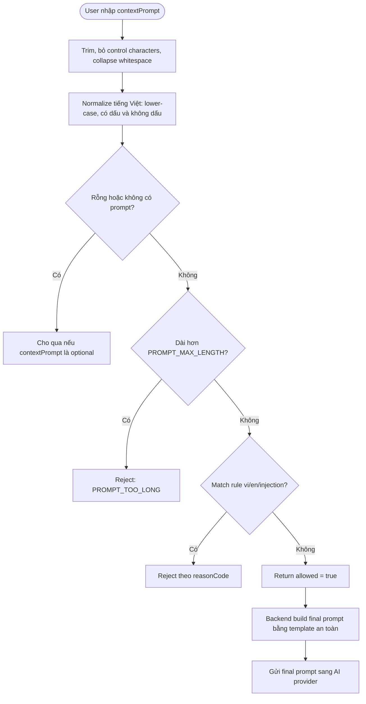

# Prompt Policy & Nguồn Dữ Liệu Cho Phòng Phối Đồ Ảo

## 1. Mục tiêu

Tài liệu này ghi nhận phần xử lý prompt cho phòng phối đồ ảo:

- Prompt người dùng được phép nhập gì.
- Dữ liệu kiểm tra prompt lấy từ đâu.
- Đầu vào, đầu ra của bước kiểm tra prompt.
- Các rule sẽ lưu ở đâu trong source code.
- Những dữ liệu nào có thể dùng để huấn luyện/fine-tune mô hình kiểm duyệt prompt sau này.

Thiết kế này giữ nguyên quyết định MVP: không thêm collection mới, chỉ dùng `virtualtryonassets` và `virtualtryonjobs`.

## 2. Quyết định lưu dữ liệu

Prompt policy không lưu trong database ở MVP.

Dữ liệu rule nên lưu bằng file JSON trong backend:

```text
backend/src/modules/virtual-try-on/prompt-policy/
├── prompt-policy.service.ts
├── prompt-policy.types.ts
└── rules/
    ├── vi.json
    ├── en.json
    ├── injection.json
    └── sources.md
```

Lý do chọn JSON:

- Dễ đọc, dễ review khi code review.
- Không cần thêm dependency YAML.
- Có thể import trực tiếp vào TypeScript nếu cấu hình build hỗ trợ JSON.
- Phù hợp với rule dạng danh sách từ/cụm từ, category và reason code.
- Không làm database phình to khi rule còn ít và chưa cần admin chỉnh trực tiếp.

## 3. Nguồn dữ liệu

### 3.1. Nguồn nội bộ từ nghiệp vụ shop

Đây là nguồn chính để quyết định rule nào được phép hoặc bị chặn.

Prompt trong phòng phối đồ ảo chỉ nên dùng để mô tả:

- Bối cảnh mặc đồ: đi làm, đi chơi, du lịch, tiệc, thể thao.
- Phong cách: thanh lịch, năng động, tối giản, sang trọng.
- Màu sắc/vibe: sáng, trầm, vintage, hiện đại.
- Tình huống phối đồ an toàn: phỏng vấn, hẹn hò, cà phê, sự kiện.

Prompt cần chặn:

- Khỏa thân, gợi dục, nội dung tình dục.
- Đồ lót/lingerie/underwear theo hướng nhạy cảm.
- Bạo lực, máu, vũ khí, tự làm hại.
- Thù ghét, xúc phạm nhóm người.
- Yêu cầu lấy system prompt, bỏ qua rule, jailbreak AI.
- Thông tin cá nhân nhạy cảm.

Nguồn nội bộ liên quan trong hệ thống:

| Dữ liệu | Nơi lấy | Cách dùng |
|---|---|---|
| `contextPrompt` | Request tạo `virtualtryonjobs` | Input chính để validate |
| `contextPreset` | Request tạo job | Dùng làm ngữ cảnh hợp lệ |
| `selectedItems` | Request tạo job | Dùng build final prompt an toàn |
| `outfitMode` | Request tạo job | Giới hạn kiểu phối đồ |
| `errorCode`, `errorMessage` | `virtualtryonjobs` | Ghi nhận lỗi sau khi job đã tạo |
| `providerMetadata` | `virtualtryonjobs` | Lưu chi tiết provider nếu AI từ chối |

### 3.2. Nguồn open-source tham khảo

Các nguồn này chỉ dùng để tham khảo và chọn lọc, không copy nguyên danh sách vào dự án.

| Nhóm | Nguồn | Mục đích |
|---|---|---|
| Tiếng Việt | https://github.com/blue-eyes-vn/vietnamese-offensive-words | Tham khảo từ/cụm từ tiếng Việt không phù hợp |
| Tiếng Anh | https://github.com/dsojevic/profanity-list | Tham khảo cấu trúc list JSON/plain text |
| Tiếng Anh/đa ngôn ngữ | https://github.com/LDNOOBWV2/List-of-Dirty-Naughty-Obscene-and-Otherwise-Bad-Words_V2 | Tham khảo nhóm từ nhạy cảm rộng hơn |
| Prompt injection | https://github.com/swisskyrepo/PayloadsAllTheThings/tree/master/Prompt%20Injection | Tham khảo mẫu prompt injection/jailbreak |
| Prompt injection | https://github.com/OWASP/www-project-ai-testing-guide/blob/main/Document/content/tests/AITG-APP-01_Testing_for_Prompt_Injection.md | Tham khảo hướng kiểm thử prompt injection |

Nguyên tắc dùng nguồn open-source:

- Kiểm tra license trước khi đưa dữ liệu vào repo.
- Chỉ lấy các term phù hợp với bài toán phối đồ ảo.
- Không đưa toàn bộ profanity list vào vì dễ chặn nhầm.
- Ưu tiên cụm từ rõ nghĩa hơn là từ đơn quá ngắn.
- Với tiếng Việt, cần xét cả có dấu và không dấu.

### 3.3. Nguồn vận hành sau này

Khi tính năng chạy thật, dữ liệu thực tế sẽ quan trọng hơn list ban đầu.

Nguồn vận hành có thể lấy từ:

- Prompt bị backend chặn.
- Prompt provider AI từ chối.
- Prompt gây kết quả sai hoặc không phù hợp.
- Prompt admin test bằng công cụ prompt tester.
- Phản hồi của CS/admin khi job thất bại.

Ở MVP không tạo collection riêng để lưu prompt log. Nếu cần debug, dùng server log hoặc thông tin lỗi trong `virtualtryonjobs` khi job đã được tạo.

## 4. Cấu trúc rule JSON

Mỗi file rule nên là mảng object:

```json
[
  {
    "key": "sexual_content_vi",
    "category": "sexual_content",
    "reasonCode": "PROMPT_SEXUAL_CONTENT",
    "terms": ["khoa than", "khỏa thân"]
  }
]
```

Ý nghĩa field:

| Field | Ý nghĩa |
|---|---|
| `key` | Mã rule ổn định để debug |
| `category` | Nhóm nội dung bị chặn |
| `reasonCode` | Mã lỗi trả về cho backend/client |
| `terms` | Danh sách từ/cụm từ cần match |

Các nhóm rule ban đầu:

| File | Nhóm dữ liệu |
|---|---|
| `vi.json` | Từ/cụm từ tiếng Việt về nội dung nhạy cảm, bạo lực, dữ liệu cá nhân |
| `en.json` | Từ/cụm từ tiếng Anh tương ứng |
| `injection.json` | Cụm từ jailbreak, bỏ qua hướng dẫn, lấy system prompt |

## 5. Đầu vào

Input trực tiếp của prompt policy:

```json
{
  "contextPrompt": "Đi phỏng vấn ở văn phòng hiện đại",
  "contextPreset": "work",
  "outfitMode": "top_bottom"
}
```

Input gián tiếp từ hệ thống:

| Input | Nguồn | Vai trò |
|---|---|---|
| `PROMPT_MAX_LENGTH` | Backend config | Giới hạn độ dài prompt |
| Rule JSON | `prompt-policy/rules` | Danh sách rule cần chặn |
| Preset hợp lệ | Backend enum/config | Đảm bảo prompt nằm trong bối cảnh phối đồ |
| Selected items | Request tạo job | Build final prompt cho AI provider |
| Provider constraints | `.env`/service config | Điều chỉnh prompt theo provider |

## 6. Đầu ra

Nếu prompt hợp lệ:

```json
{
  "allowed": true,
  "normalizedPrompt": "Đi phỏng vấn ở văn phòng hiện đại",
  "reasonCode": null,
  "message": null
}
```

Nếu prompt bị chặn:

```json
{
  "allowed": false,
  "normalizedPrompt": null,
  "reasonCode": "PROMPT_POLICY_BLOCKED",
  "message": "Mô tả bối cảnh không phù hợp cho phối đồ ảo",
  "matchedCategory": "prompt_injection",
  "matchedRule": "ignore_previous_instruction"
}
```

Với client người dùng cuối, không nhất thiết trả `matchedRule` chi tiết để tránh lộ rule. Với admin prompt tester, có thể hiển thị thêm `matchedCategory` và `matchedRule` để debug.

## 7. Luồng xử lý prompt



Nguyên tắc quan trọng:

- Không gửi nguyên prompt người dùng trực tiếp sang AI provider.
- Backend chỉ dùng `contextPrompt` như một phần nhỏ trong template an toàn.
- Prompt injection bị chặn trước khi tạo job.
- Prompt hợp lệ mới được lưu vào `virtualtryonjobs.contextPrompt`.

## 8. Kế hoạch implement

| Bước | Việc làm | File/Folder |
|---|---|---|
| 1 | Tạo folder prompt policy và rule JSON | `backend/src/modules/virtual-try-on/prompt-policy/` |
| 2 | Chuyển danh sách block hiện tại khỏi service chính | `prompt-policy.service.ts` |
| 3 | Thêm normalize tiếng Việt có dấu/không dấu | `prompt-policy.service.ts` |
| 4 | Thêm rule tiếng Việt, tiếng Anh, injection | `rules/*.json` |
| 5 | Gắn validator vào API tạo job | `virtual-try-on.service.ts` |
| 6 | Gắn validator vào admin prompt tester | `virtual-try-on.service.ts` |
| 7 | Bổ sung response chi tiết cho admin | `virtualTryOn.types.ts`, admin UI |
| 8 | Thêm test case cho prompt hợp lệ/bị chặn | Backend tests nếu project có setup test |

## 9. Dữ liệu cần huấn luyện mô hình nếu làm nâng cao

MVP chưa cần train mô hình riêng. Nếu sau này muốn có model phân loại prompt tốt hơn rule-based, cần dữ liệu có nhãn:

| Field | Ý nghĩa |
|---|---|
| `prompt` | Nội dung người dùng nhập, đã loại bỏ dữ liệu cá nhân nếu có |
| `language` | `vi`, `en`, `mixed`, `unknown` |
| `label` | `allowed` hoặc `blocked` |
| `category` | `sexual_content`, `violence`, `prompt_injection`, `personal_data`, `safe_fashion_context` |
| `reasonCode` | Mã lý do backend dùng |
| `reviewerDecision` | Admin/QA xác nhận đúng hay chặn nhầm |
| `providerDecision` | AI provider có chấp nhận không |
| `createdAt` | Thời điểm ghi nhận dữ liệu |

Nguồn lấy dữ liệu training sau này:

- Server log đã ẩn danh hóa.
- Lỗi provider trong `virtualtryonjobs.providerMetadata`.
- `virtualtryonjobs.errorCode` và `virtualtryonjobs.errorMessage`.
- Bộ prompt test do team tự viết.
- Prompt admin kiểm thử trong giai đoạn QA.

Không nên dùng prompt thật của user để train nếu chưa có cơ chế ẩn danh hóa và chính sách quyền riêng tư rõ ràng.

## 10. Phạm vi không làm ở MVP

- Không tạo collection `promptRules`.
- Không tạo collection `promptLogs`.
- Không làm admin CRUD rule.
- Không train model kiểm duyệt prompt riêng.
- Không copy toàn bộ profanity list open-source vào repo.
- Không hiển thị rule quá chi tiết cho user cuối.

## 11. Liên kết với các phần khác

| Phần | Liên kết |
|---|---|
| Mobile phòng phối đồ | Gửi `contextPrompt`, hiển thị lỗi prompt không hợp lệ |
| Admin phòng phối đồ | Có prompt tester và xem lỗi job |
| AI provider | Chỉ nhận final prompt do backend build |
| Product catalog | Dữ liệu sản phẩm dùng để build final prompt an toàn |
| `virtualtryonjobs` | Lưu prompt hợp lệ và lỗi sau khi job đã tạo |
| `virtualtryonassets` | Không liên quan trực tiếp đến prompt, chỉ lưu ảnh/video |

