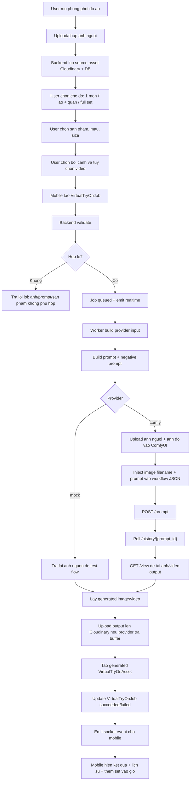
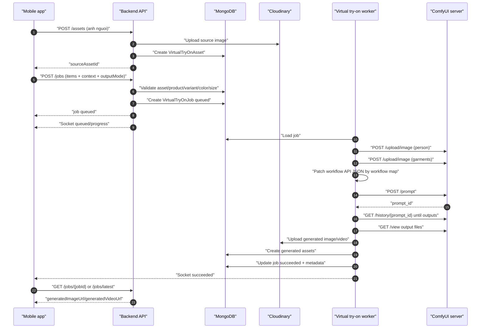

# Kế hoạch tính năng Phối đồ ảo / Virtual Try-On

> Branch: `feature/virtual-try-on`
>
> Ngày lập kế hoạch: 2026-06-27
>
> Phạm vi chính: mobile app khách hàng, backend API, realtime processing, lưu trữ ảnh người dùng và lịch sử kết quả. Web/admin chỉ làm phần hỗ trợ tối thiểu ở các phase sau.

## 1. Mục tiêu

Xây dựng một khu vực `Phối đồ ảo` như một home screen riêng trong mobile app, nơi khách hàng có thể:

- Tải ảnh cá nhân hoặc chụp ảnh toàn thân trực tiếp.
- Lưu và quản lý thư viện ảnh cá nhân theo từng user.
- Chọn một món, nhiều món hoặc cả set gồm áo, quần, giày, phụ kiện từ catalog hiện có.
- Chọn bối cảnh gợi ý, nhập bối cảnh tùy chỉnh hoặc bỏ qua bối cảnh.
- Gửi yêu cầu tạo kết quả thử đồ bằng AI theo dạng bất đồng bộ.
- Nhận ảnh kết quả, lưu lịch sử, chia sẻ, tải về và thêm sản phẩm/set vào giỏ hàng.
- Sau này có thể bật thêm chế độ sinh video mà không phải đổi lại kiến trúc chính.

Tính năng này không nên chỉ là wizard tuyến tính như các màn hình tham khảo. Nên là một `Virtual Try-On Home` đẹp, giàu ngữ cảnh, có lối vào nhanh, lịch sử gần đây, ảnh đã lưu, draft đang làm và các CTA rõ ràng.

### 1.1. Mức sẵn sàng triển khai

Có thể triển khai ngay theo 2 mức:

| Mức | Làm được ngay | Còn chờ |
|---|---|---|
| MVP mock provider | Mobile UI/UX, upload/chụp ảnh, chọn sản phẩm, chọn bối cảnh, tạo job, processing, result mock, lịch sử, thêm set vào giỏ | Không có ảnh AI thật |
| AI thật | Dùng cùng UI/API/database/worker đã thiết kế | Docs provider sinh ảnh/video, API key, giới hạn quota/cost, format input/output |

Vì vậy không cần chờ AI provider để làm phần sản phẩm. Nên làm trước nền tảng và mock flow để kiểm tra logic người dùng, sau đó cắm AI sinh ảnh vào adapter.

## 2. Hiện trạng đã đối chiếu

### 2.1. Docs hiện có

Đã kiểm tra nhóm tài liệu `docs/phan-he/08-ml-integrations-async/`:

- `01-backend-plan.md` đã định hướng virtual try-on đi qua backend queue, worker gọi ML service/FastAPI/Comfy Cloud, kết quả gửi về frontend bằng Socket.IO.
- `02-chuc-nang.md` đã mô tả luồng cơ bản: chọn sản phẩm, tải/chụp ảnh, gửi sang dịch vụ xử lý, xem kết quả và thêm vào giỏ.
- `03-database.md` đã có collection `Virtual Try on Room`, nhưng schema còn đơn giản và dùng `productId/versionId`.
- `04-api-kien-truc.md` đề xuất `POST /api/ml/virtual-try-on`, Socket.IO và queue.

Điểm cần cập nhật trong plan mới:

- Code hiện tại của catalog đã chuyển từ `version/versionId` sang `variant`, `variantId`, `colorVariantId`.
- Backend chưa có module `/api/ml` và chưa có BullMQ/Redis dependency.
- Backend đã có Socket.IO cho orders/support, có thể reuse pattern gateway.
- Backend đã có Cloudinary, Multer memory upload, validate JPEG/PNG/WEBP, limit 5MB/file.
- Mobile đã có `expo-image-picker`, `expo-image`, `socket.io-client`, đủ cho MVP upload/chụp ảnh/realtime mà chưa cần thêm dependency lớn.

### 2.2. Code hiện có liên quan

Mobile:

- `mobile/src/features/home/HomeScreen.tsx`
  - Đã có card `Phòng thử đồ` nhưng đang gọi `handleComingSoon`.
  - Đây là entry point phù hợp để điều hướng sang `VirtualTryOnHome`.
- `mobile/src/navigation/AppNavigator.tsx`
  - Có thể thêm stack screens mới mà không phá cấu trúc hiện tại.
- `mobile/src/features/catalog/catalogApi.ts`
  - Có `CatalogProduct`, `CatalogProductDetail`, `ProductDetailVariant`, `ProductDetailColor`.
  - Product list trả dữ liệu gọn, product detail mới có variants/colors/sizes đầy đủ.
- `mobile/src/features/cart/cartApi.ts`
  - Add cart cần `productId`, `variantId`, `colorVariantId`, `size`, `quantity`.

Backend:

- `backend/src/database/models/product.model.ts`
  - Product dùng `variant[]`, mỗi variant có `colors[]`.
- `backend/src/middlewares/upload.middleware.ts`
  - Có `upload`, `uploadMultiple`, `validateUploadedImageContent`.
- `backend/src/utils/cloudinary.util.ts`
  - Có upload/delete Cloudinary qua buffer.
- `backend/src/modules/realtime/order.gateway.ts`
  - Pattern Socket.IO authenticated gateway tốt để làm `virtual-try-on.gateway.ts`.
- `backend/package.json`
  - Chưa có Redis/BullMQ. Nếu cần queue thật phải thêm dependency và hạ tầng.

## 3. Quyết định sản phẩm

### 3.1. Tên tính năng

Tên hiển thị tiếng Việt:

- Chính: `Phối đồ ảo`
- Subtitle: `Thử outfit bằng ảnh của bạn`

Không nên dùng `Phòng thử đồ thông minh` làm H1 chính vì dài và hơi chung. Có thể dùng trong mô tả ngắn.

### 3.2. Đối tượng dùng

MVP yêu cầu đăng nhập trước khi tạo/lưu kết quả vì tính năng có ảnh cá nhân nhạy cảm và cần thư viện theo user.

Khách chưa đăng nhập:

- Được thấy entry trên Home.
- Khi bấm bắt đầu, chuyển sang Login hoặc hiển thị modal yêu cầu đăng nhập.

Khách đã đăng nhập:

- Được upload/chụp ảnh.
- Được lưu ảnh nguồn, kết quả và lịch sử.
- Được xóa ảnh/kết quả của chính mình.

### 3.3. Ảnh cá nhân là dữ liệu nhạy cảm

Phải có các nguyên tắc:

- Chỉ user sở hữu ảnh mới xem/xóa được ảnh và job.
- Không hiển thị ảnh user ở admin MVP, trừ khi sau này có consent riêng cho hỗ trợ lỗi.
- Mỗi ảnh nguồn và kết quả phải lưu `publicId` để xóa khỏi Cloudinary.
- UI cần có link/nút `Xóa ảnh` trong thư viện.
- Không dùng ảnh của user cho training hoặc dữ liệu demo.
- Không log URL ảnh cá nhân trong log lỗi nếu không cần.

### 3.4. Bối cảnh là tùy chọn

Người dùng có 3 lựa chọn:

- `Không đổi bối cảnh`: giữ nền ảnh gốc hoặc nền trung tính tùy provider.
- `Bối cảnh gợi ý`: đi làm, đi chơi, dự tiệc, du lịch, thể thao, hẹn hò.
- `Mô tả riêng`: text prompt ngắn, ví dụ `Đi phỏng vấn ở văn phòng hiện đại`.

Không bắt buộc nhập bối cảnh trước khi tạo kết quả.

### 3.5. Video là optional output mode

MVP mặc định chỉ tạo ảnh.

Chế độ video phải được thiết kế sẵn trong dữ liệu và API:

- `outputMode = image | image_and_video`
- `generatedImageUrl`
- `generatedVideoUrl`
- `videoStatus = not_requested | queued | processing | succeeded | failed`

Khi chưa có AI video provider, UI vẫn có thể ẩn toggle video bằng feature flag.

### 3.6. AI sinh ảnh/video để cắm sau

Plan này chừa sẵn adapter provider. Khi bạn bổ sung docs hoặc chọn AI provider, chỉ cần triển khai adapter mới theo interface đã định nghĩa, không phải đổi lại mobile flow, database và API.

Provider ban đầu nên có:

- `mock`: trả ảnh placeholder hoặc ảnh kết quả mẫu để test UI/end-to-end.
- `external_http`: gọi service AI qua HTTP khi có docs.
- `disabled`: trả lỗi nghiệp vụ rõ ràng nếu chưa cấu hình.

## 4. UX tổng thể

### 4.1. Vấn đề của các màn tham khảo

Các screen hiện tại có thể dùng làm cảm hứng, nhưng chưa tối ưu:

- Intro screen quá chiếm diện tích, sau lần đầu không còn giá trị nhiều.
- Upload screen nhiều khoảng trắng, chưa cho thấy ảnh đã lưu hoặc draft gần đây.
- Product selection đã đúng hướng nhưng selection tray quá nặng, dễ che nội dung nếu chọn nhiều món.
- Context screen bắt người dùng đi thêm một bước dù bối cảnh có thể optional.
- Processing screen chỉ chờ, chưa có khả năng rời màn và quay lại job.
- Result screen có hướng tốt nhưng cần gắn chặt với variant/color/size và cart API hiện có.

### 4.2. Hướng thiết kế mới

Tạo `VirtualTryOnHomeScreen` như một dashboard nhỏ:

1. Header đẹp, có preview ảnh người dùng hoặc silhouette.
2. CTA chính:
   - `Tải ảnh`
   - `Chụp ảnh`
   - `Dùng ảnh đã lưu`
3. Draft đang làm:
   - ảnh nguồn
   - số sản phẩm đã chọn
   - bối cảnh
   - nút tiếp tục
4. Chế độ phối:
   - `Một món`
   - `Áo + quần`
   - `Full set`
5. Bối cảnh nhanh:
   - chips nhỏ, có thể bỏ qua
6. Lịch sử gần đây:
   - 2-column result cards
   - trạng thái processing/succeeded/failed
7. CTA phụ:
   - `Xem thư viện ảnh`
   - `Xem lịch sử`

Không nên tạo landing page marketing. Màn đầu tiên phải dùng được ngay.

### 4.3. Style đề xuất

Giữ tinh thần app hiện tại:

- Nền sáng, nhiều khoảng thở nhưng không để trống quá nhiều.
- Dùng màu brand xanh xám hiện có, phối thêm trắng, slate/dark text, xanh lá cho trạng thái thành công.
- Card bo góc vừa phải, bóng nhẹ.
- Ảnh/result là yếu tố chính, không để text áp đảo.
- CTA chính dùng gradient/brand fill; CTA phụ dạng outline hoặc icon button.
- Trạng thái job dùng progress timeline nhỏ thay vì spinner trống toàn màn.

### 4.4. UI/UX cụ thể theo vùng màn hình

`VirtualTryOnHomeScreen` nên là màn chính của feature, không phải intro một lần. Layout đề xuất:

| Vùng | Nội dung | Mục đích UX |
|---|---|---|
| Header | Back/menu, title `Phối đồ ảo`, icon lịch sử/thư viện | Người dùng biết đang ở tool chính, dễ quay lại lịch sử |
| Hero workspace | Ảnh cá nhân gần nhất hoặc silhouette, CTA `Tải ảnh`, `Chụp ảnh` | Đưa hành động quan trọng nhất lên đầu |
| Draft card | Ảnh nguồn, số món đã chọn, bối cảnh, trạng thái `Tiếp tục phối` | Không mất việc đang làm khi rời màn |
| Mode segmented control | `Một món`, `Áo + quần`, `Full set` | Người dùng chọn mức phối trước khi chọn sản phẩm |
| Quick context chips | `Không đổi nền`, `Đi làm`, `Đi chơi`, `Dự tiệc`, `Du lịch` | Bối cảnh là optional, chọn nhanh không tạo bước thừa |
| Recent results | Grid 2 cột, card processing/succeeded/failed | Tính năng có giá trị lặp lại, không chỉ tạo một lần |
| Bottom CTA | `Bắt đầu phối đồ` hoặc `Tạo kết quả` khi đủ dữ liệu | CTA thay đổi theo trạng thái draft |

`OutfitBuilderScreen` nên ưu tiên thao tác nhanh:

- Top tabs theo role: `Áo`, `Quần`, `Giày`, `Phụ kiện`.
- Search field nằm ngay dưới tabs.
- Product grid 2 cột, mỗi card có ảnh, tên, giá, trạng thái selected.
- Khi bấm product, mở bottom sheet chọn `variant/color/size` thay vì chuyển sang Product Detail.
- Selected rail cố định phía dưới, cao vừa đủ, không che toàn bộ grid.
- CTA `Tiếp tục` chỉ bật khi có ít nhất 1 món hợp lệ.

`ResultScreen` phải tập trung vào kết quả:

- Ảnh kết quả chiếm phần lớn first viewport.
- Action nhỏ phía trên/dưới ảnh: `Tải`, `Chia sẻ`, `Tạo lại`.
- Set details nằm dưới ảnh, có tổng giá và CTA `Thêm cả set`.
- Nếu add cart thiếu size, mở size picker tại chỗ, không đẩy user quay lại builder.

### 4.5. Logic người dùng có thể chọn

| Nhóm lựa chọn | Options | Default | Bắt buộc | Ghi chú logic |
|---|---|---|---|---|
| Nguồn ảnh | `Tải ảnh`, `Chụp ảnh`, `Dùng ảnh đã lưu` | Không có | Có | Yêu cầu login; mỗi ảnh lưu thành asset riêng |
| Chế độ phối | `Một món`, `Áo + quần`, `Full set` | `Full set` | Có | Chế độ quyết định số role được chọn và validation |
| Sản phẩm | Áo, quần, giày, phụ kiện, áo khoác | Không có | Có ít nhất 1 | Chọn product -> chọn variant/color; size optional cho try-on |
| Bối cảnh | Không đổi nền, preset, custom prompt | `Không đổi nền` | Không | Custom prompt tối đa 200 ký tự |
| Output | Ảnh, ảnh + video | `Ảnh` | Có | Video ẩn nếu feature flag chưa bật |
| Lưu kết quả | Lưu tự động vào lịch sử | Bật | Có | Kết quả là dữ liệu cá nhân của user |
| Thêm vào giỏ | Thêm từng món hoặc cả set | Không có | Không | Size bắt buộc ở bước add cart |

Validation UX:

- Chưa có ảnh nguồn: CTA chính là `Tải ảnh`/`Chụp ảnh`.
- Có ảnh nhưng chưa có sản phẩm: CTA là `Chọn sản phẩm`.
- Có ảnh và sản phẩm: CTA là `Tạo kết quả`.
- Đang có job processing: CTA là `Xem tiến trình`.
- Có kết quả mới: CTA là `Xem kết quả`.

### 4.6. Input và output theo từng bước

| Bước | Input từ user | Input hệ thống | Output |
|---|---|---|---|
| Mở feature | Token đăng nhập | Latest assets/jobs | Home state: ảnh gần nhất, draft, lịch sử |
| Upload/chụp ảnh | Local image URI | Auth token, upload API | `VirtualTryOnAsset` nguồn |
| Chọn sản phẩm | Product/variant/color/size | Catalog products/detail | `selectedItems[]` có role và snapshot |
| Chọn bối cảnh | Preset hoặc custom text | Context preset config | `contextPreset`, `contextPrompt` |
| Review request | Confirm output mode | Draft đầy đủ | Payload tạo job |
| Tạo job | Submit | Backend validation, provider config | `VirtualTryOnJob` status `queued` |
| Processing | Không bắt buộc ở lại màn | Worker/provider, realtime | Progress events, job status |
| Result | Action tải/chia sẻ/add cart | Generated asset, product snapshots | Ảnh/video kết quả, cart updates nếu add |

## 5. Information Architecture mobile

Thêm feature:

```text
mobile/src/features/virtualTryOn/
  VirtualTryOnHomeScreen.tsx
  PhotoPickerScreen.tsx
  PhotoLibraryScreen.tsx
  OutfitBuilderScreen.tsx
  ContextComposerScreen.tsx
  TryOnReviewScreen.tsx
  TryOnProcessingScreen.tsx
  TryOnResultScreen.tsx
  TryOnHistoryScreen.tsx
  virtualTryOnApi.ts
  virtualTryOnRealtime.ts
  virtualTryOn.types.ts
  virtualTryOnDraft.ts
  components/
    TryOnHeader.tsx
    PhotoSourceCard.tsx
    OutfitModeSegment.tsx
    SelectedOutfitRail.tsx
    ContextPresetGrid.tsx
    TryOnJobCard.tsx
    TryOnResultActions.tsx
```

### 5.1. Routes đề xuất

Cập nhật `RootStackParamList`:

```ts
VirtualTryOnHome: undefined;
VirtualTryOnPhotoPicker: undefined;
VirtualTryOnPhotoLibrary: { selectMode?: boolean } | undefined;
VirtualTryOnOutfitBuilder: {
  assetId?: string;
  mode?: 'single' | 'top_bottom' | 'full_set';
} | undefined;
VirtualTryOnContext: {
  draftId?: string;
} | undefined;
VirtualTryOnReview: {
  draftId: string;
} | undefined;
VirtualTryOnProcessing: {
  jobId: string;
} | undefined;
VirtualTryOnResult: {
  jobId: string;
} | undefined;
VirtualTryOnHistory: undefined;
```

Nếu muốn đơn giản hơn cho MVP, có thể gom `ContextComposer` và `Review` vào bottom sheet trong `OutfitBuilderScreen`, nhưng vẫn nên giữ type route rõ để sau này mở rộng.

### 5.2. Danh sách screen mobile cần có

| Screen | Vai trò | UI chính | User action | Output điều hướng/dữ liệu |
|---|---|---|---|---|
| `VirtualTryOnHomeScreen` | Dashboard chính của feature | Hero ảnh cá nhân, CTA upload/chụp, mode selector, draft, recent results | Bắt đầu, tiếp tục draft, xem lịch sử, xem thư viện | Điều hướng tới upload/library/builder/history/result |
| `PhotoPickerScreen` | Hướng dẫn và chọn nguồn ảnh | Guideline chụp ảnh tốt, nút `Tải ảnh`, `Chụp ảnh` | Chọn ảnh từ thư viện hoặc camera | Upload asset, tạo/cập nhật draft `assetId` |
| `PhotoLibraryScreen` | Quản lý ảnh cá nhân | Grid ảnh nguồn/kết quả, preview, delete action | Chọn ảnh để dùng, xóa ảnh, xem ảnh lớn | Trả `assetId` cho draft hoặc xóa asset |
| `OutfitBuilderScreen` | Chọn sản phẩm phối | Role tabs, search, product grid, bottom sheet variant/color/size, selected rail | Chọn/bỏ món, đổi variant/color, chọn size | `selectedItems[]`, chuyển context/review |
| `ContextComposerScreen` | Chọn bối cảnh | Preset grid, custom prompt, skip option | Chọn preset, nhập mô tả, bỏ qua | `contextPreset/contextPrompt` |
| `TryOnReviewScreen` | Xác nhận trước khi tạo | Ảnh nguồn, set đã chọn, bối cảnh, output mode, cost/quota note nếu có | Submit job, quay lại sửa | `jobId`, chuyển processing |
| `TryOnProcessingScreen` | Theo dõi job | Preview nhỏ, progress steps, realtime status, CTA rời màn | Chờ, rời màn, retry nếu fail | Chuyển result khi succeeded |
| `TryOnResultScreen` | Xem và hành động với kết quả | Generated image/video, context badge, set detail, total price, action row | Tải, chia sẻ, đổi bối cảnh, thử lại, thêm giỏ | Cart updates hoặc tạo job mới |
| `TryOnHistoryScreen` | Lịch sử phối đồ | List/grid jobs theo status/date | Xem lại, xóa khỏi lịch sử, retry failed | Điều hướng result/processing |

### 5.3. Screen nào nên gộp trong MVP

Để làm nhanh mà vẫn đúng UX, MVP có thể gộp:

- `PhotoPickerScreen` thành bottom sheet trong `VirtualTryOnHomeScreen`.
- `ContextComposerScreen` thành section trong `TryOnReviewScreen`.
- `TryOnHistoryScreen` dùng lại list component của `VirtualTryOnHomeScreen` nhưng có phân trang.

Không nên gộp `OutfitBuilderScreen` và `ResultScreen` vì đây là hai trải nghiệm khác nhau: một bên là chọn, một bên là xem kết quả/mua hàng.

## 6. Luồng người dùng chi tiết

### 6.1. Entry từ Home

File: `mobile/src/features/home/HomeScreen.tsx`

Thay action hiện tại:

```ts
onPress={() => handleComingSoon('Phòng thử đồ')}
```

bằng:

```ts
onPress={() => navigation.navigate(isAuthenticated ? 'VirtualTryOnHome' : 'Login')}
```

Nếu muốn giữ context sau login, có thể truyền `redirectTo` ở phase sau.

### 6.2. Virtual Try-On Home

Screen phải hiển thị:

- Greeting ngắn theo user.
- Hero preview:
  - Nếu đã có ảnh cá nhân gần nhất: hiển thị thumbnail.
  - Nếu chưa có: hiển thị silhouette + hướng dẫn `Chụp toàn thân, nền sáng`.
- Quick actions:
  - `Tải ảnh`
  - `Chụp ảnh`
  - `Ảnh của tôi`
- Continue card:
  - Nếu có draft/job chưa xong, cho `Tiếp tục`.
- Outfit mode segment:
  - `Một món`
  - `Áo + quần`
  - `Full set`
- Recent results:
  - Tối đa 4 job gần nhất.
  - Card processing có progress/status.
- Footer action:
  - `Lịch sử phối đồ`

Home này thay cho intro full-screen. Nếu cần onboarding lần đầu, dùng một modal ngắn hoặc collapsible card, không chặn toàn bộ flow.

### 6.3. Upload/chụp ảnh

Dùng `expo-image-picker` đã có:

- `launchImageLibraryAsync`
- `launchCameraAsync`
- `allowsEditing: false` để giữ toàn thân.
- `quality: 0.9` cho ảnh nguồn.

Validation mobile trước upload:

- Chỉ nhận image.
- Nếu asset size có thể đọc được và vượt 5MB, cảnh báo trước.
- Nhắc ảnh tốt:
  - đứng thẳng
  - chụp toàn thân
  - ánh sáng rõ
  - nền ít rối
  - không che mặt/cơ thể quá nhiều nếu muốn kết quả tốt

Backend vẫn là nơi validate cuối cùng.

Sau upload thành công:

- Lưu `assetId`.
- Điều hướng sang `VirtualTryOnOutfitBuilder`.

### 6.4. Thư viện ảnh cá nhân

Screen `PhotoLibraryScreen`:

- Grid ảnh nguồn đã upload/chụp.
- Filter:
  - `Tất cả`
  - `Ảnh nguồn`
  - `Kết quả`
- Action mỗi ảnh:
  - chọn dùng tiếp
  - xem lớn
  - xóa

Quy tắc:

- Xóa ảnh nguồn không nên xóa job lịch sử đã tạo, nhưng job phải giữ snapshot URL/result riêng.
- Nếu ảnh nguồn bị xóa khỏi Cloudinary, job cũ vẫn giữ result; source thumbnail có thể hiện `Ảnh nguồn đã xóa`.

### 6.5. Chọn sản phẩm/outfit

Screen `OutfitBuilderScreen` dùng catalog hiện có.

Tabs:

- `Áo`
- `Quần`
- `Giày dép`
- `Phụ kiện`

MVP có thể map bằng keyword/category name vì model Category chưa có `tryOnRole`. Phase sau nên thêm field:

```ts
tryOnRole?: 'top' | 'bottom' | 'dress' | 'shoes' | 'accessory' | 'outerwear';
```

Luồng chọn:

1. Load products bằng `catalogApi.getProducts`.
2. User search/filter trong tab hiện tại.
3. Tap product mở mini detail/bottom sheet để chọn:
   - variant
   - color
   - size optional
4. Add vào selected outfit rail.
5. Nếu chọn cùng role:
   - `single`: thay món cũ.
   - `top_bottom/full_set`: hỏi thay thế hoặc cho phép nhiều layer nếu role là `outerwear`.

Selected item phải lưu:

```ts
type TryOnSelectedItem = {
  productId: string;
  variantId: string;
  colorVariantId: string;
  size?: string;
  role: 'top' | 'bottom' | 'dress' | 'shoes' | 'accessory' | 'outerwear';
  nameSnapshot: string;
  colorSnapshot?: string;
  imageSnapshot: string;
  priceSnapshot: number;
  finalPriceSnapshot: number;
};
```

Điều kiện submit:

- Tối thiểu 1 item.
- Tối đa MVP: 4 item.
- Không cho chọn cả `dress` và `top/bottom` cùng lúc nếu provider chưa hỗ trợ layer phức tạp.
- Size không bắt buộc để AI thử đồ, nhưng bắt buộc khi `Thêm vào giỏ`. Nếu thiếu size, result screen phải yêu cầu chọn size trước khi add cart.

### 6.6. Chọn bối cảnh

Có thể là screen riêng hoặc section trong review step.

Preset:

| Key | Label | Prompt nội bộ |
|---|---|---|
| `none` | Không đổi bối cảnh | preserve original background or neutral studio |
| `work` | Đi làm | professional office, clean and polished |
| `casual` | Đi chơi | casual city street, natural daylight |
| `party` | Dự tiệc | elegant evening event, warm lighting |
| `travel` | Du lịch | outdoor travel scene, bright natural light |
| `sport` | Thể thao | active sporty setting |
| `date` | Hẹn hò | romantic cafe or evening city |
| `custom` | Tự mô tả | user text |

Custom text:

- 0-200 ký tự.
- Không bắt buộc.
- Backend trim và lưu cả `contextPreset` lẫn `contextPrompt`.

### 6.7. Review trước khi tạo

`TryOnReviewScreen`:

- Hiển thị ảnh nguồn.
- Hiển thị selected outfit cards.
- Hiển thị bối cảnh.
- Toggle output:
  - `Ảnh`
  - `Ảnh + video` nếu feature flag bật.
- CTA `Tạo kết quả`.

Submit:

- Gọi `POST /api/virtual-try-on/jobs`.
- Backend trả ngay `jobId`, `status`.
- Điều hướng sang `TryOnProcessingScreen`.

### 6.8. Processing

Không dùng màn trắng chỉ có spinner.

Screen nên có:

- Preview ảnh nguồn nhỏ.
- Danh sách outfit đang xử lý.
- Stepper:
  - `Đã nhận yêu cầu`
  - `Đang chuẩn bị ảnh`
  - `AI đang tạo kết quả`
  - `Lưu kết quả`
- CTA phụ:
  - `Tiếp tục mua sắm`
  - `Xem lịch sử`
- Text rõ: `Bạn có thể rời màn này, kết quả sẽ được lưu trong lịch sử.`

Realtime:

- Subscribe `jobId`.
- Nếu socket mất kết nối, poll `GET /api/virtual-try-on/jobs/:jobId`.
- Khi app mở lại, `VirtualTryOnHome` gọi latest processing/succeeded job để resume.

### 6.9. Result

`TryOnResultScreen`:

- Header: `Kết quả phối đồ`
- Badge bối cảnh.
- Ảnh kết quả lớn, aspect ratio ổn định.
- Nếu có video: thumbnail/video player hoặc CTA `Xem video`.
- Action row:
  - `Chia sẻ`
  - `Tải về`
  - `Tạo lại`
  - `Đổi bối cảnh`
- `Chi tiết set đồ`:
  - list item snapshot
  - price/finalPrice
  - color/size nếu có
- Tổng giá trị.
- CTA:
  - `Thêm cả set`
  - `Thử set khác`

Add cart:

- Nếu tất cả item có size: gọi `cartApi.addItem` từng item.
- Nếu thiếu size: mở size picker từng item trước.
- Nếu một item hết hàng: báo rõ item nào lỗi, cho thêm các item còn hợp lệ.

## 7. Backend architecture

### 7.1. Module mới

```text
backend/src/modules/virtual-try-on/
  virtual-try-on.route.ts
  virtual-try-on.controller.ts
  virtual-try-on.service.ts
  virtual-try-on.types.ts
  virtual-try-on.validation.ts
  virtual-try-on-assets.service.ts
  virtual-try-on-jobs.service.ts
  virtual-try-on-worker.ts
  providers/
    virtual-try-on-provider.ts
    mock-virtual-try-on.provider.ts
    external-http-virtual-try-on.provider.ts
```

Models:

```text
backend/src/database/models/virtual-try-on-asset.model.ts
backend/src/database/models/virtual-try-on-job.model.ts
```

Realtime:

```text
backend/src/modules/realtime/virtual-try-on.gateway.ts
```

Register:

- `backend/src/database/models/index.ts`
- `backend/src/routes/index.ts`
- `backend/src/server.ts`

### 7.2. Vì sao không dùng `/api/ml` ngay

Docs cũ đề xuất `/api/ml/virtual-try-on`, nhưng code hiện tại chưa có ML router. Với tính năng hướng khách hàng, nên dùng:

```text
/api/virtual-try-on
```

Lý do:

- API public/customer không bị ràng buộc tên hạ tầng ML.
- Sau này provider có thể là FastAPI, Comfy, OpenAI, service nội bộ hoặc mock mà app không cần biết.
- Dễ gom assets/history/jobs dưới cùng domain nghiệp vụ.

Nếu vẫn muốn giữ compatibility docs cũ, có thể alias:

```text
POST /api/ml/virtual-try-on -> POST /api/virtual-try-on/jobs
```

nhưng không cần cho MVP.

## 8. Database design

### 8.1. VirtualTryOnAsset

Lưu ảnh nguồn và ảnh kết quả thuộc user.

```ts
type VirtualTryOnAssetType = 'source_upload' | 'source_camera' | 'generated_image' | 'generated_video';

type VirtualTryOnAsset = {
  _id: ObjectId;
  userId: ObjectId;
  type: VirtualTryOnAssetType;
  url: string;
  thumbnailUrl?: string;
  publicId: string;
  mimeType?: 'image/jpeg' | 'image/png' | 'image/webp' | 'video/mp4';
  width?: number;
  height?: number;
  bytes?: number;
  source?: 'upload' | 'camera' | 'ai_provider';
  status: 'active' | 'deleted';
  deletedAt?: Date | null;
  createdAt: Date;
  updatedAt: Date;
};
```

Indexes:

```ts
{ userId: 1, createdAt: -1 }
{ userId: 1, type: 1, createdAt: -1 }
{ status: 1, createdAt: -1 }
```

### 8.2. VirtualTryOnJob

Thay thế/mở rộng schema `Virtual Try on Room` cũ.

```ts
type VirtualTryOnJobStatus =
  | 'draft'
  | 'queued'
  | 'processing'
  | 'succeeded'
  | 'failed'
  | 'canceled';

type VirtualTryOnOutputMode = 'image' | 'image_and_video';

type VirtualTryOnSelectedItem = {
  productId: ObjectId;
  variantId: ObjectId;
  colorVariantId: ObjectId;
  size?: string;
  role: 'top' | 'bottom' | 'dress' | 'shoes' | 'accessory' | 'outerwear';
  nameSnapshot: string;
  colorSnapshot?: string;
  imageSnapshot: string;
  priceSnapshot: number;
  finalPriceSnapshot: number;
};

type VirtualTryOnJob = {
  _id: ObjectId;
  userId: ObjectId;
  sourceAssetId: ObjectId;
  sourceImageUrlSnapshot: string;
  selectedItems: VirtualTryOnSelectedItem[];
  outfitMode: 'single' | 'top_bottom' | 'full_set';
  contextPreset:
    | 'none'
    | 'work'
    | 'casual'
    | 'party'
    | 'travel'
    | 'sport'
    | 'date'
    | 'custom';
  contextPrompt?: string;
  outputMode: VirtualTryOnOutputMode;
  status: VirtualTryOnJobStatus;
  progress: number;
  generatedImageAssetId?: ObjectId | null;
  generatedImageUrl?: string | null;
  generatedVideoAssetId?: ObjectId | null;
  generatedVideoUrl?: string | null;
  provider: 'mock' | 'external_http' | 'disabled' | string;
  providerJobId?: string | null;
  providerMetadata?: Record<string, unknown>;
  errorCode?: string | null;
  errorMessage?: string | null;
  idempotencyKey?: string | null;
  startedAt?: Date | null;
  completedAt?: Date | null;
  createdAt: Date;
  updatedAt: Date;
};
```

Indexes:

```ts
{ userId: 1, createdAt: -1 }
{ userId: 1, status: 1, createdAt: -1 }
{ status: 1, createdAt: 1 }
{ userId: 1, idempotencyKey: 1 } unique partial when idempotencyKey exists
```

### 8.3. Lưu ý schema hiện tại

Docs cũ dùng:

```text
productId: Array<ObjectId>
versionId: Array<ObjectId>
userImage: Array<String>
generatedImage: String
```

Không nên triển khai y nguyên vì code catalog hiện tại cần:

- `productId`
- `variantId`
- `colorVariantId`
- `size` cho cart

Nếu giữ field `versionId` sẽ gây lỗi mapping khi thêm set vào giỏ.

## 9. API đề xuất

Tất cả route dưới đây yêu cầu auth `user`.

### 9.1. Assets

```text
POST /api/virtual-try-on/assets
Content-Type: multipart/form-data
Field: image
```

Response:

```json
{
  "data": {
    "_id": "assetId",
    "type": "source_upload",
    "url": "https://...",
    "thumbnailUrl": "https://...",
    "createdAt": "2026-06-27T00:00:00.000Z"
  }
}
```

Validation:

- JPEG/PNG/WEBP.
- 5MB/file ở MVP để dùng middleware hiện có.
- Magic bytes phải khớp MIME.
- User phải đăng nhập.

Endpoints khác:

```text
GET /api/virtual-try-on/assets?type=source_upload&page=1&limit=20
DELETE /api/virtual-try-on/assets/:assetId
```

Delete:

- Chỉ owner được xóa.
- Soft delete DB trước.
- Best-effort delete Cloudinary.
- Không xóa job history cũ.

### 9.2. Jobs

Create:

```text
POST /api/virtual-try-on/jobs
Content-Type: application/json
Idempotency-Key: optional
```

Request:

```json
{
  "sourceAssetId": "assetId",
  "outfitMode": "full_set",
  "selectedItems": [
    {
      "productId": "productId",
      "variantId": "variantId",
      "colorVariantId": "colorVariantId",
      "size": "M",
      "role": "top"
    }
  ],
  "contextPreset": "work",
  "contextPrompt": "",
  "outputMode": "image"
}
```

Backend phải tự snapshot product data từ DB, không tin name/price/image từ client.

Response:

```json
{
  "data": {
    "_id": "jobId",
    "status": "queued",
    "progress": 0,
    "createdAt": "2026-06-27T00:00:00.000Z"
  }
}
```

Read:

```text
GET /api/virtual-try-on/jobs/:jobId
GET /api/virtual-try-on/jobs/latest
GET /api/virtual-try-on/jobs?status=succeeded&page=1&limit=20
POST /api/virtual-try-on/jobs/:jobId/retry
POST /api/virtual-try-on/jobs/:jobId/cancel
DELETE /api/virtual-try-on/jobs/:jobId
```

`DELETE` job nên là soft delete khỏi lịch sử user. Không xóa sản phẩm khỏi catalog.

### 9.3. Add set to cart

MVP có thể dùng mobile gọi `cartApi.addItem` từng item.

Nếu muốn backend gom logic tốt hơn:

```text
POST /api/virtual-try-on/jobs/:jobId/add-to-cart
```

Request:

```json
{
  "items": [
    {
      "productId": "productId",
      "variantId": "variantId",
      "colorVariantId": "colorVariantId",
      "size": "M",
      "quantity": 1
    }
  ]
}
```

Response dùng lại cart summary.

Ưu tiên MVP: gọi cart API hiện có để tránh nhân đôi logic tồn kho.

### 9.4. Input/output nghiệp vụ chuẩn hóa

#### Upload source image

Input:

```ts
{
  image: File;
  source: 'upload' | 'camera';
}
```

Output:

```ts
{
  assetId: string;
  url: string;
  thumbnailUrl?: string;
  width?: number;
  height?: number;
  createdAt: string;
}
```

#### Create try-on job

Input:

```ts
{
  sourceAssetId: string;
  outfitMode: 'single' | 'top_bottom' | 'full_set';
  selectedItems: Array<{
    productId: string;
    variantId: string;
    colorVariantId: string;
    size?: string;
    role: 'top' | 'bottom' | 'dress' | 'shoes' | 'accessory' | 'outerwear';
  }>;
  contextPreset: 'none' | 'work' | 'casual' | 'party' | 'travel' | 'sport' | 'date' | 'custom';
  contextPrompt?: string;
  outputMode: 'image' | 'image_and_video';
}
```

Output ngay lập tức:

```ts
{
  jobId: string;
  status: 'queued';
  progress: 0;
  estimatedSeconds?: number;
}
```

Output cuối cùng:

```ts
{
  jobId: string;
  status: 'succeeded';
  generatedImageUrl: string;
  generatedVideoUrl?: string;
  selectedItems: TryOnSelectedItem[];
  totalFinalPrice: number;
}
```

#### Failed job

Output:

```ts
{
  jobId: string;
  status: 'failed';
  errorCode: 'PROVIDER_UNAVAILABLE' | 'INVALID_IMAGE' | 'TIMEOUT' | 'POLICY_BLOCKED' | 'UNKNOWN';
  errorMessage: string;
  canRetry: boolean;
}
```

Mobile phải hiển thị lỗi thân thiện, ví dụ:

- `Ảnh chưa phù hợp để thử đồ. Bạn thử ảnh toàn thân rõ sáng hơn nhé.`
- `Dịch vụ tạo ảnh đang bận. Bạn có thể thử lại sau.`
- `Không thể tạo video lúc này, ảnh vẫn được lưu trong lịch sử.`

## 10. Realtime

### 10.1. Gateway mới

```text
Socket.IO path: /realtime/virtual-try-on
Event receive: virtual_try_on:event
Client emit: virtual_try_on:subscribe(jobId)
Client emit: virtual_try_on:unsubscribe(jobId)
```

Auth giống order/support gateway:

- Token trong `socket.handshake.auth.token`.
- Verify access token.
- Join `user:{userId}`.

Rooms:

```ts
const jobRoom = (jobId: string) => `virtual-try-on:job:${jobId}`;
const userRoom = (userId: string) => `user:${userId}`;
```

Event shape:

```ts
type VirtualTryOnRealtimeEvent = {
  type: 'queued' | 'processing' | 'progress' | 'succeeded' | 'failed' | 'canceled';
  jobId: string;
  status: VirtualTryOnJobStatus;
  progress: number;
  generatedImageUrl?: string | null;
  generatedVideoUrl?: string | null;
  errorMessage?: string | null;
  at: string;
};
```

### 10.2. Quy tắc tránh mất kết quả

Worker/provider phải làm đúng thứ tự:

1. Nhận kết quả AI.
2. Upload/lưu result vào Cloudinary nếu provider trả buffer/base64.
3. Tạo `VirtualTryOnAsset` cho generated result.
4. Update `VirtualTryOnJob` thành `succeeded`.
5. Sau khi DB save thành công mới emit socket event.

Mobile khi reconnect hoặc mở app:

- Gọi `GET /api/virtual-try-on/jobs/latest`.
- Nếu latest là `processing/queued`, hiện continue card.
- Nếu latest vừa `succeeded`, hiện result card kể cả đã miss socket event.

## 11. AI provider adapter

### 11.1. Interface chừa sẵn

```ts
export type VirtualTryOnProviderInput = {
  jobId: string;
  userId: string;
  sourceImageUrl: string;
  garments: Array<{
    role: string;
    productId: string;
    variantId: string;
    colorVariantId: string;
    imageUrl: string;
    name: string;
    color?: string;
  }>;
  context: {
    preset: string;
    prompt?: string;
    preserveOriginalBackground: boolean;
  };
  outputMode: 'image' | 'image_and_video';
};

export type VirtualTryOnProviderResult = {
  imageUrl?: string;
  imageBuffer?: Buffer;
  imageMimeType?: 'image/jpeg' | 'image/png' | 'image/webp';
  videoUrl?: string;
  metadata?: Record<string, unknown>;
};

export interface VirtualTryOnProvider {
  generate(input: VirtualTryOnProviderInput): Promise<VirtualTryOnProviderResult>;
}
```

### 11.2. Provider config

Thêm env:

```env
VIRTUAL_TRY_ON_PROVIDER=mock
VIRTUAL_TRY_ON_SERVICE_URL=
VIRTUAL_TRY_ON_API_KEY=
VIRTUAL_TRY_ON_ENABLE_VIDEO=false
VIRTUAL_TRY_ON_MAX_SELECTED_ITEMS=4
VIRTUAL_TRY_ON_MAX_CONCURRENT_JOBS_PER_USER=1
```

Khi bạn bổ sung docs AI:

- Nếu provider nhận URL ảnh: adapter gửi URL Cloudinary.
- Nếu provider nhận multipart/base64: adapter tải ảnh hoặc lấy buffer từ source.
- Nếu provider xử lý async riêng: adapter lưu `providerJobId`, worker poll provider status.
- Nếu provider trả video: map vào `generatedVideoUrl` và `generatedVideoAssetId`.

### 11.3. Mock provider cho MVP

Mock provider không cần tạo ảnh thật. Có thể:

- Trả ảnh placeholder từ assets/dev.
- Hoặc trả lại ảnh nguồn với metadata `mock: true`.
- Hoặc ghép layout đơn giản để test result screen.

Mục tiêu mock:

- Hoàn thiện flow upload -> select products -> create job -> processing -> result.
- Test realtime, history, add cart, retry/error.
- Không block UI/backend trong lúc chờ provider thật.

### 11.4. Luong tich hop AI/ComfyUI

Tong quan luong tu app den AI provider:



Luong goi ComfyUI chi tiet:



File map workflow Comfy nen tach rieng voi workflow export:

```json
{
  "inputs": {
    "personImage": "12.inputs.image",
    "topImage": "18.inputs.image",
    "bottomImage": "21.inputs.image",
    "dressImage": "22.inputs.image",
    "shoesImage": "24.inputs.image",
    "positivePrompt": "30.inputs.text",
    "negativePrompt": "31.inputs.text",
    "seed": "5.inputs.seed"
  },
  "outputs": {
    "imageNodeIds": ["88"],
    "videoNodeIds": ["96"]
  }
}
```

Y nghia: workflow JSON la graph that tu ComfyUI; file map chi noi backend biet node nao nhan anh nguoi, node nao nhan anh ao/quan/giay, node nao nhan prompt va node nao la output.

## 12. Job processing strategy

### 12.1. MVP không thêm Redis/BullMQ ngay

Vì backend hiện chưa có Redis/BullMQ dependency, MVP có thể dùng in-process worker:

- Controller tạo job `queued`.
- Service gọi `virtualTryOnWorker.enqueue(jobId)`.
- Worker chạy async bằng `setImmediate` hoặc một in-memory queue nhỏ.
- Job status vẫn lưu DB.
- Nếu process restart khi job đang queued/processing, job có thể kẹt; API retry xử lý lại.

Giới hạn:

- Không phù hợp production scale.
- Không survive process restart hoàn hảo.
- Không chạy đa instance ổn định.

### 12.2. Production phase dùng BullMQ/Redis

Khi AI provider thật và job lâu 10-60s:

- Thêm Redis/BullMQ.
- Tách worker process.
- Retry/backoff theo lỗi.
- Timeout job.
- Cleanup stuck jobs.
- Rate limit per user.

Không nên thêm BullMQ trước khi provider thật được chọn nếu mục tiêu hiện tại là plan/MVP UI.

## 13. Validation và bảo mật

### 13.1. Asset upload

- Chỉ owner user.
- MIME: JPEG, PNG, WEBP.
- Magic bytes validate.
- Max 5MB/file MVP.
- Cloudinary folder riêng:

```text
fashion-ecommerce/virtual-try-on/users/{userId}/source
fashion-ecommerce/virtual-try-on/users/{userId}/results
```

### 13.2. Job create

Validate:

- `sourceAssetId` tồn tại, thuộc user, status active.
- `selectedItems.length`: 1-4.
- Từng product/variant/color tồn tại và active.
- `variantId` thuộc `productId`.
- `colorVariantId` thuộc `variantId`.
- `size` nếu có phải thuộc variant size measurements.
- `contextPrompt` max 200 ký tự.
- `outputMode=image_and_video` chỉ cho phép khi feature flag bật.

### 13.3. Rate limit

Ngoài global rate limit hiện có, nên thêm nghiệp vụ:

- Max 1 job processing cùng lúc/user ở MVP.
- Max 10 job/ngày/user cho môi trường demo nếu AI tốn phí.
- Chặn double tap bằng idempotency key.

### 13.4. IDOR

Mọi endpoint `assets/:id` và `jobs/:id` phải query kèm `userId`.

Không dùng:

```ts
VirtualTryOnJob.findById(jobId)
```

mà dùng:

```ts
VirtualTryOnJob.findOne({ _id: jobId, userId })
```

## 14. Mobile API layer

File: `mobile/src/features/virtualTryOn/virtualTryOnApi.ts`

Types:

```ts
export type VirtualTryOnAsset = {
  _id: string;
  type: 'source_upload' | 'source_camera' | 'generated_image' | 'generated_video';
  url: string;
  thumbnailUrl?: string;
  createdAt: string;
};

export type VirtualTryOnJob = {
  _id: string;
  status: 'draft' | 'queued' | 'processing' | 'succeeded' | 'failed' | 'canceled';
  progress: number;
  sourceAsset: VirtualTryOnAsset;
  selectedItems: TryOnSelectedItem[];
  contextPreset: string;
  contextPrompt?: string;
  outputMode: 'image' | 'image_and_video';
  generatedImageUrl?: string | null;
  generatedVideoUrl?: string | null;
  errorMessage?: string | null;
  createdAt: string;
  updatedAt: string;
};
```

Methods:

```ts
uploadAsset(token, localUri, source)
getAssets(token, params)
deleteAsset(token, assetId)
createJob(token, payload, idempotencyKey)
getJob(token, jobId)
getLatestJob(token)
getJobs(token, params)
retryJob(token, jobId)
cancelJob(token, jobId)
```

FormData upload:

- Không set `Content-Type` thủ công; để React Native tự set boundary.
- Dùng `apiFetch('/virtual-try-on/assets', { method: 'POST', headers: { Authorization }, body: formData })`.

## 15. Draft state mobile

Không cần Redux. Dùng module state nhẹ hoặc React context riêng trong feature.

Draft shape:

```ts
type VirtualTryOnDraft = {
  draftId: string;
  assetId?: string;
  localPreviewUri?: string;
  outfitMode: 'single' | 'top_bottom' | 'full_set';
  selectedItems: TryOnSelectedItem[];
  contextPreset: string;
  contextPrompt?: string;
  outputMode: 'image' | 'image_and_video';
  updatedAt: number;
};
```

MVP có thể giữ trong memory. Phase sau lưu draft vào `AsyncStorage` nếu muốn resume sau khi app bị kill.

## 16. Web admin quản lý gì

Web admin không nên là nơi nhân viên xem tự do ảnh cá nhân của khách. Admin chủ yếu quản lý cấu hình, vận hành, thống kê và lỗi provider.

### 16.1. Admin MVP nên có

| Khu vực | Admin quản lý | Không nên làm ở MVP |
|---|---|---|
| Tổng quan | Tổng job, job thành công/thất bại, thời gian xử lý trung bình | Xem toàn bộ ảnh cá nhân dạng gallery |
| Job monitor | Lọc job theo status, provider, ngày, user, errorCode | Sửa trực tiếp output của job |
| Provider settings | Provider đang dùng, service URL, bật/tắt mock, timeout, video flag | Lưu API secret lộ trực tiếp trên UI |
| Quota | Max job/ngày/user, max concurrent jobs, bật/tắt video | Tính phí phức tạp nếu chưa có billing |
| Context presets | Label, icon, prompt nội bộ, thứ tự hiển thị, bật/tắt | Cho prompt quá dài hoặc không kiểm duyệt |
| Catalog mapping | Gán category/keyword vào role áo/quần/giày/phụ kiện | Bắt mobile hard-code toàn bộ category |
| Cleanup | Xóa mềm job cũ, dọn asset đã deleted, retry stuck jobs | Xóa cứng hàng loạt không audit |

### 16.2. Admin screens đề xuất

```text
web_frontend/src/features/admin/modules/virtual-try-on/
  VirtualTryOnDashboardPage.tsx
  VirtualTryOnJobListPage.tsx
  VirtualTryOnJobDetailDrawer.tsx
  VirtualTryOnSettingsPage.tsx
  VirtualTryOnPresetManager.tsx
  virtualTryOn.service.ts
  virtualTryOn.types.ts
  virtualTryOn.css
```

Routes:

```text
/admin/virtual-try-on
/admin/virtual-try-on/jobs
/admin/virtual-try-on/settings
/admin/virtual-try-on/presets
```

### 16.3. Dashboard admin

Các card:

- Job hôm nay.
- Tỷ lệ thành công.
- Tỷ lệ lỗi.
- Thời gian xử lý trung bình.
- Provider hiện tại.
- Video đang bật/tắt.

Charts/list:

- Job theo ngày.
- Top error codes.
- Top context presets.
- Top product roles được thử.

### 16.4. Job list admin

Columns:

- Mã job.
- User masked: tên/email che một phần.
- Status.
- Output mode.
- Provider.
- Số món.
- Bối cảnh.
- Thời gian tạo.
- Thời gian hoàn tất.
- Error code.

Filters:

- Status: queued/processing/succeeded/failed/canceled.
- Provider.
- Output mode.
- Date range.
- Error code.
- User keyword.

Actions:

- Xem metadata job.
- Retry job failed/stuck.
- Cancel job queued/processing nếu còn cho phép.
- Copy job id.
- Ẩn khỏi lịch sử user nếu vi phạm/chưa phù hợp.

### 16.5. Job detail drawer

Hiển thị:

- Job metadata.
- Selected product snapshots.
- Context preset/prompt.
- Provider metadata đã sanitize.
- Error logs ngắn.
- Timeline status.

Quy tắc ảnh:

- Mặc định không hiển thị ảnh source của user.
- Chỉ hiển thị generated thumbnail nếu có chính sách cho phép.
- Nếu cần xem ảnh để debug, phải có permission riêng như `virtual_try_on.debug_images` và ghi audit log.

### 16.6. Settings admin

Cấu hình:

```ts
type VirtualTryOnAdminSettings = {
  provider: 'mock' | 'external_http' | 'disabled';
  isEnabled: boolean;
  enableVideo: boolean;
  maxSelectedItems: number;
  maxConcurrentJobsPerUser: number;
  maxJobsPerUserPerDay: number;
  jobTimeoutSeconds: number;
  sourceImageMaxMb: number;
};
```

Settings có thể lưu trong env ở MVP. Nếu muốn admin chỉnh runtime, cần thêm collection cấu hình và audit log.

### 16.7. Preset/context manager

Admin có thể quản lý preset:

- Label tiếng Việt.
- Icon/key.
- Prompt nội bộ gửi provider.
- Sort order.
- Active/inactive.

Ví dụ:

```ts
{
  key: 'work',
  label: 'Đi làm',
  icon: 'briefcase',
  prompt: 'professional office, clean outfit, natural posture',
  isActive: true,
  sortOrder: 10
}
```

### 16.8. Catalog role mapping

Để mobile biết sản phẩm nào là áo/quần/giày/phụ kiện, admin nên có cách cấu hình:

Phase MVP:

- Backend map bằng category name/keyword.
- Admin chưa cần UI riêng.

Phase tốt hơn:

- Thêm field `tryOnRole` vào Category hoặc Product.
- Admin Catalog có dropdown `Vai trò phối đồ`.
- Virtual Try-On admin có màn rà soát category chưa được map.

Roles:

```ts
'top' | 'bottom' | 'dress' | 'shoes' | 'accessory' | 'outerwear'
```

### 16.9. Permissions admin

Đề xuất quyền:

- `virtual_try_on.read`: xem dashboard/job metadata.
- `virtual_try_on.manage`: retry/cancel job, ẩn job.
- `virtual_try_on.settings`: chỉnh provider/quota/presets.
- `virtual_try_on.debug_images`: xem ảnh phục vụ debug, mặc định chỉ admin cấp cao.

Mọi action nhạy cảm phải ghi audit log.

## 17. Thứ tự triển khai đề xuất

### Phase 0 - Docs alignment

- [x] Tạo plan chi tiết này.
- [ ] Nếu muốn, bổ sung link vào `docs/README.md`.
- [ ] Khi có docs AI provider, cập nhật section 11 bằng request/response thật.

### Phase 1 - Backend nền với mock provider

- [ ] Tạo models `VirtualTryOnAsset`, `VirtualTryOnJob`.
- [ ] Export models trong `database/models/index.ts`.
- [ ] Tạo route `/api/virtual-try-on`.
- [ ] Tạo upload asset endpoint với Cloudinary folder riêng.
- [ ] Tạo create/read/list/delete job endpoints.
- [ ] Tạo mock provider.
- [ ] Tạo in-process worker cập nhật status/progress/result.
- [ ] Viết tests cho validation ownership, upload, create job.

Acceptance:

- Upload ảnh trả asset URL.
- Create job trả `queued`.
- Mock job chuyển `succeeded`.
- User A không xem/xóa job/asset của user B.

### Phase 2 - Realtime

- [ ] Tạo `virtual-try-on.gateway.ts`.
- [ ] Attach gateway trong `server.ts`.
- [ ] Worker emit events sau khi DB update.
- [ ] Mobile hook `virtualTryOnRealtime.ts`.

Acceptance:

- Processing screen tự chuyển sang result khi job succeeded.
- Tắt app/reconnect vẫn lấy lại latest job bằng API.

### Phase 3 - Mobile MVP UI

- [ ] Add routes vào `AppNavigator`.
- [ ] Update Home card điều hướng sang `VirtualTryOnHome`.
- [ ] Build `VirtualTryOnHomeScreen`.
- [ ] Build upload/chụp ảnh.
- [ ] Build photo library.
- [ ] Build outfit builder dùng catalog API.
- [ ] Build context/review step.
- [ ] Build processing screen.
- [ ] Build result screen.
- [ ] Add set to cart bằng cart API hiện có.

Acceptance:

- User đăng nhập có thể upload/chụp ảnh.
- User chọn ít nhất 1 sản phẩm và tạo job.
- User thấy result mock.
- User thêm được sản phẩm đủ size vào giỏ.
- Lịch sử hiển thị job đã tạo.

### Phase 4 - AI provider thật

- [ ] Nhận docs provider từ bạn.
- [ ] Map input/output vào `VirtualTryOnProvider`.
- [ ] Xử lý auth/API key.
- [ ] Xử lý ảnh result dạng URL/base64/buffer.
- [ ] Thêm timeout/retry.
- [ ] Lưu provider metadata tối thiểu.
- [ ] Bật feature flag theo môi trường.

Acceptance:

- Job thật tạo ra ảnh kết quả.
- Lỗi provider trả message thân thiện.
- Kết quả luôn lưu DB trước khi emit realtime.

### Phase 5 - Video output

- [ ] Bật `VIRTUAL_TRY_ON_ENABLE_VIDEO`.
- [ ] Thêm UI toggle `Ảnh + video`.
- [ ] Adapter provider xử lý video.
- [ ] Lưu `generatedVideoAssetId/generatedVideoUrl`.
- [ ] Result screen hỗ trợ xem/chia sẻ video.

Acceptance:

- Nếu video provider lỗi nhưng ảnh thành công, job vẫn có thể `succeeded_with_video_failed` hoặc `succeeded` kèm `videoStatus=failed`.
- User không mất ảnh vì video lỗi.

### Phase 6 - Hardening

- [ ] BullMQ/Redis nếu job thật lâu hoặc cần scale.
- [ ] Cleanup stuck jobs.
- [ ] Quota/rate limit per user.
- [ ] Monitoring failed jobs.
- [ ] Privacy deletion flow đầy đủ.
- [ ] E2E mobile happy path.

## 18. Test plan

Backend unit/integration:

- Upload invalid MIME -> 400.
- Upload JPEG MIME nhưng content không phải JPEG -> 400.
- Upload >5MB -> 400.
- User không đăng nhập -> 401.
- User tạo job với asset của người khác -> 404/403.
- Job với product không tồn tại -> 400.
- Job với variant không thuộc product -> 400.
- Job với color không thuộc variant -> 400.
- Create duplicate idempotency key -> trả cùng job hoặc không tạo trùng.
- Worker success -> DB có generated asset và job succeeded.
- Worker fail -> job failed, có errorCode/errorMessage.

Mobile:

- Home card vào đúng screen.
- Chưa login bấm vào -> Login.
- Upload ảnh thành công.
- Chụp ảnh thành công.
- Delete asset khỏi library.
- Search/select product.
- Chọn variant/color/size.
- Submit thiếu product -> disable CTA.
- Submit thiếu size vẫn được try-on nhưng add cart yêu cầu size.
- Processing nhận realtime event.
- Mất mạng/reopen app lấy latest job.
- Add set to cart xử lý partial failure.

Manual visual QA:

- iPhone/Android small viewport.
- Text không tràn nút/card.
- Product grid không bị selection tray che CTA.
- Result image không méo aspect ratio.
- Loading/empty/error states đầy đủ.

## 19. Rủi ro và cách xử lý

| Rủi ro | Tác động | Cách xử lý |
|---|---|---|
| AI provider chưa chọn | Không có ảnh thật | Dùng mock provider và interface chừa sẵn |
| Job lâu/mất kết nối | User tưởng mất kết quả | Lưu DB trước, reconnect gọi latest job |
| Ảnh cá nhân nhạy cảm | Privacy risk | Ownership strict, delete flow, không log URL |
| Catalog chưa có role áo/quần/giày | Product tab chưa chuẩn | MVP map keyword/category, phase sau thêm `tryOnRole` |
| Chưa có BullMQ | In-process worker không production-grade | Chỉ dùng MVP/mock, phase production thêm Redis/BullMQ |
| Size không bắt buộc cho AI nhưng bắt buộc cho cart | Add cart lỗi | Result screen mở size picker trước khi add |
| Video tốn chi phí/thời gian | UX chậm, lỗi nhiều | Ẩn bằng feature flag, bật sau ảnh |

## 20. Phần còn thiếu để chạy AI thật

### 20.1. Đã có nền

- Mobile flow chọn ảnh, chọn món, màu, size, bối cảnh và tùy chọn tạo video.
- List/filter sản phẩm theo áo, quần, giày, thương hiệu.
- Backend có `VirtualTryOnAsset`, `VirtualTryOnJob`, realtime status và mock provider.
- Provider scaffold đã chừa sẵn để gắn ComfyUI.
- Prompt builder đã tách riêng, backend tự build prompt cuối thay vì cho user gửi thẳng vào AI.
- Workflow map mẫu đã có để nối node ComfyUI sau này.
- Plan đã có flowchart và sequence diagram cho luồng AI/ComfyUI.

### 20.2. Thiếu để chạy ComfyUI thật

- Export workflow API JSON thật từ ComfyUI.
- Cập nhật workflow map theo node thật:
  - ảnh người;
  - ảnh áo;
  - ảnh quần/váy;
  - ảnh giày;
  - positive prompt;
  - negative prompt;
  - output ảnh;
  - output video nếu có.
- Test `VIRTUAL_TRY_ON_PROVIDER=comfy` với một job ảnh trước.
- Xác nhận graph hỗ trợ các mode:
  - `single`;
  - `top_bottom`;
  - `full_set`.
- Xác nhận graph có giữ đúng màu/sản phẩm từ ảnh catalog không.

### 20.3. Thiếu phần nhận diện ảnh đầu vào

- Check ảnh có người hay không.
- Check số lượng người trong ảnh, MVP nên ưu tiên 1 người.
- Check người đủ lớn và đủ rõ trong khung hình.
- Check ảnh không bị cắt mất vùng cần phối đồ.
- Check ảnh quá mờ, quá tối hoặc quá nhỏ.
- Gợi ý kỹ thuật:
  - MediaPipe/Pose để check người và landmarks;
  - object/person detector nếu chỉ cần biết có người;
  - tách thành moderation service riêng khi production.

### 20.4. Thiếu moderation ảnh

- Chặn ảnh nude/phản cảm.
- Chặn ảnh underwear-only nếu policy chưa cho phép.
- Chặn ảnh trẻ em nếu hệ thống chưa có policy riêng.
- Chặn ảnh không phù hợp để phối đồ như phong cảnh, sản phẩm, ảnh nhiều người quá rối.
- Không log URL ảnh cá nhân trong backend/provider logs.
- Cần quyết định ảnh fail moderation có lưu tạm để audit không, hay xóa ngay.

### 20.5. Thiếu moderation prompt

- Hiện chỉ có keyword rule cơ bản cho `contextPrompt`.
- Cần bổ sung allowlist/preset rõ hơn cho bối cảnh an toàn.
- Cần chặn prompt yêu cầu:
  - phản cảm;
  - bạo lực;
  - trẻ em/sexualized;
  - giả mạo thương hiệu hoặc watermark;
  - thay đổi danh tính/người nổi tiếng nếu không cho phép.
- Phase sau có thể thêm model/API moderation cho prompt trước khi tạo job.

### 20.6. Thiếu phần video

- UI đã có toggle và backend đã có `outputMode`.
- Cần graph ComfyUI có output video thật.
- Cần xử lý case ảnh thành công nhưng video lỗi.
- Cần giới hạn thời gian tạo video và quota vì video tốn chi phí hơn ảnh.
- Result screen cần trạng thái video riêng nếu muốn UX rõ:
  - `not_requested`;
  - `processing`;
  - `succeeded`;
  - `failed`.

### 20.7. Thiếu production worker

- Hiện worker xử lý in-process, đủ MVP/mock nhưng chưa production-grade.
- Khi AI job lâu hoặc có nhiều user, cần Redis/BullMQ.
- Cần timeout, retry, backoff và cleanup stuck jobs.
- Cần đảm bảo nhiều backend instance không xử lý trùng cùng một job.
- Cần dashboard/monitor lỗi provider.

### 20.8. Thiếu privacy và lifecycle dữ liệu

- Xóa source image của user đầy đủ.
- Xóa generated image/video đầy đủ.
- Xóa cả Cloudinary asset khi user xóa trong app.
- Chính sách retention: giữ ảnh bao lâu, tự xóa sau bao lâu nếu cần.
- Admin chỉ nên xem metadata mặc định; ảnh cá nhân nên cần quyền cao hoặc bị ẩn.

### 20.9. Thiếu test thực tế

- Test ảnh người thật nhiều tư thế, nhiều ánh sáng.
- Test chọn sai ảnh: phong cảnh, ảnh sản phẩm, ảnh nhiều người, ảnh mờ.
- Test từng mode: 1 món, áo + quần, full set.
- Test màu/size đúng với biến thể đã chọn.
- Test prompt xấu bị chặn.
- Test ComfyUI lỗi, timeout, trả thiếu output.
- Test mobile reconnect vẫn lấy được latest job.

### 20.10. Thứ tự nên làm tiếp

1. Export workflow ComfyUI thật và cập nhật workflow map.
2. Chạy thử một job `image` với provider `comfy`.
3. Thêm nhận diện ảnh có người.
4. Thêm moderation ảnh.
5. Siết moderation prompt.
6. Bật video sau khi ảnh chạy ổn.
7. Nâng worker lên queue nếu job AI bắt đầu dùng thường xuyên.

## 21. Checklist quyết định còn chờ

Cần bạn bổ sung sau:

- AI image provider/API docs.
- Provider có nhận URL, file multipart hay base64.
- Provider có hỗ trợ nhiều garment trong một request không.
- Provider có hỗ trợ preserve background/context prompt không.
- Provider có hỗ trợ video không, sync hay async.
- Giới hạn chi phí/quota mỗi user.
- Có cần admin xem job lỗi kèm ảnh hay chỉ metadata.

Những phần này đã có slot trong plan, không chặn việc làm backend/mobile MVP với mock provider.
